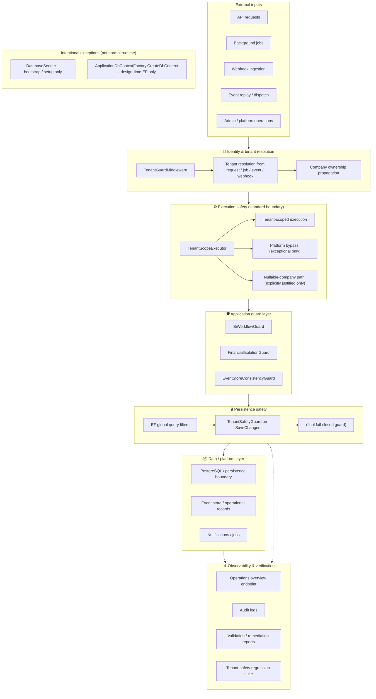
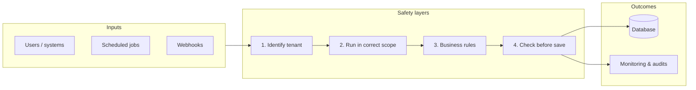

# CephasOps Security and Tenant Safety Architecture

This document provides an audit-friendly view of how CephasOps protects tenant isolation, execution safety, workflow and financial correctness, event integrity, persistence safety, and operational observability. It is suitable for technical design reviews, internal architecture documentation, compliance and governance reviews, and onboarding engineers.

---

## Diagram title

**CephasOps Security and Tenant Safety Architecture** — Layered protection from external input to persistence and observability.

---

## Diagram content

The main diagram and the **Intentional exceptions** table in this section are **generated** from the source-of-truth manifest. See the note below the diagram; do not edit the generated block by hand. To change the diagram or the exceptions table, edit `tools/architecture/tenant_safety_architecture.json` and run `./tools/architecture/generate_tenant_safety_diagram.ps1` from the repo root; then commit both the manifest and the updated doc. To refresh **all** platform-safety artifacts (this diagram, health dashboard, health JSON/history, and Platform Guardian report) in one step, run `./tools/architecture/regenerate_tenant_safety_artifacts.ps1` from the repo root. CI will fail if the generated output is not committed.

<!-- BEGIN GENERATED: tenant_safety_diagram -->

*The diagram and exceptions table below are generated from `tools/architecture/tenant_safety_architecture.json`. Run `./tools/architecture/generate_tenant_safety_diagram.ps1` to refresh.*

## Intentional exceptions

Two places still use manual **EnterPlatformBypass** (and Exit where applicable) by design. They are **not** normal runtime flows:

| Exception | Purpose |
|-----------|---------|
| **DatabaseSeeder** | One-time bootstrap/setup seeding. Enter before seeding, Exit in finally. Process-bound. |
| **ApplicationDbContextFactory.CreateDbContext** | Design-time EF Core factory (e.g. migrations, tooling). Enter in CreateDbContext; no Exit (process exits). |

All other runtime operational paths use TenantScopeExecutor; no manual scope or bypass management in hosted services, schedulers, dispatchers, replay, webhooks, or workers.

<!-- END GENERATED: tenant_safety_diagram -->

---

## Caption

**Protection flow:** External inputs (API, jobs, webhooks, event replay, admin) are first subject to **identity and tenant resolution** (TenantGuardMiddleware and resolution from request/job/event/webhook). Resolved company ownership is propagated so that all tenant-owned work runs under a known tenant. The **TenantScopeExecutor** is the standard runtime execution boundary: tenant-scoped work, platform bypass (exceptional), or explicitly justified nullable-company paths. Application guards (SiWorkflowGuard, FinancialIsolationGuard, EventStoreConsistencyGuard) enforce workflow, financial, and event-store correctness. **Persistence safety** is enforced by EF global query filters and, at write time, **TenantSafetyGuard** on SaveChanges as the final fail-closed guard. Data is stored in PostgreSQL (event store, operational records, notifications, jobs). Observability and verification (operations overview, audit logs, validation reports, tenant-safety regression suite) provide ongoing assurance.

---

## How to read this diagram

- **Top to bottom:** Flow from how work enters the system (External inputs) down to where it is stored and verified (Data layer, Observability).
- **Identity & tenant resolution:** Must happen before any tenant-owned execution. TenantGuardMiddleware and resolution logic set the effective company for the request, job, event, or webhook.
- **TenantScopeExecutor:** This is the standard boundary for runtime execution. Services should not manually set TenantScope or call EnterPlatformBypass/ExitPlatformBypass; they use the executor’s three modes (tenant scope, platform bypass, or nullable-company where justified).
- **Application guard layer:** Domain-specific guards (SI workflow, financial isolation, event-store consistency) add checks on top of tenant and execution safety.
- **TenantSafetyGuard on SaveChanges:** The last line of defense before writes hit the database. It ensures tenant context (or an explicit platform bypass) is present for tenant-scoped entities.
- **Dashed lines to Observability:** Persistence and data layer feed into operations overview, audit, reports, and the regression suite for continuous verification.

---

## Executive summary (non-developer view)

High-level view of how CephasOps keeps tenant data isolated and operations safe:

**In plain terms:** Every request, job, or webhook is first tied to a tenant (company). Work then runs in the right “scope” (that tenant or a controlled platform-wide mode). Business rules (workflow, financial, event consistency) are enforced. Before any write to the database, the system checks that the operation is allowed for that tenant. The database stores data per tenant, and monitoring and audits help verify that isolation and safety are maintained.

---

## Recommended file name and placement

| Item | Recommendation |
|------|----------------|
| **File name** | `SECURITY_AND_TENANT_SAFETY_ARCHITECTURE.md` |
| **Placement** | `backend/docs/architecture/SECURITY_AND_TENANT_SAFETY_ARCHITECTURE.md` |
| **Rationale** | Sits with [TENANT_SAFETY_DEVELOPER_GUIDE.md](TENANT_SAFETY_DEVELOPER_GUIDE.md), [TENANT_SCOPE_EXECUTOR_COMPLETION.md](TENANT_SCOPE_EXECUTOR_COMPLETION.md), and [TENANT_SCOPE_EXECUTOR_VALIDATION_REPORT.md](TENANT_SCOPE_EXECUTOR_VALIDATION_REPORT.md) for a single architecture and tenant-safety documentation set. |

---

## Cross-references

- [TENANT_SAFETY_DEVELOPER_GUIDE.md](TENANT_SAFETY_DEVELOPER_GUIDE.md) — Day-to-day rules, bypass policy, TenantScopeExecutor usage, PR checklist.
- [TENANT_SCOPE_EXECUTOR_COMPLETION.md](TENANT_SCOPE_EXECUTOR_COMPLETION.md) — Executor rollout completion and final execution standard.
- [TENANT_SCOPE_EXECUTOR_VALIDATION_REPORT.md](TENANT_SCOPE_EXECUTOR_VALIDATION_REPORT.md) — Executor introduction and validation.
- [TENANT_SAFETY_FINAL_VERIFICATION.md](../operations/TENANT_SAFETY_FINAL_VERIFICATION.md) — Full tenant safety model verification.
