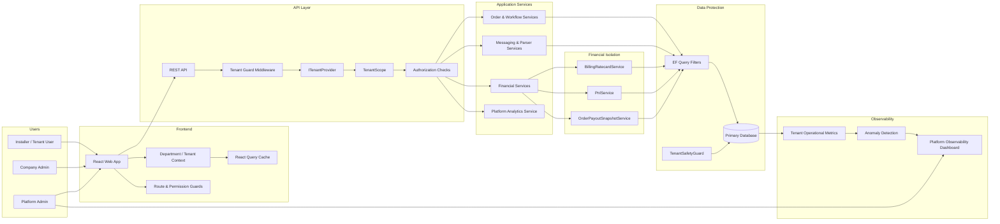

# CephasOps SaaS System Overview

**Date:** 13 March 2026  
**Purpose:** High-level overview of the CephasOps SaaS architecture for stakeholders and documentation.

---

## CephasOps SaaS Platform — Visual Overview

---

## How the System Works

### 1. Tenant Context

Every request begins with a **tenant context resolution**.

The system determines which company the request belongs to using:

- authentication token
- tenant provider
- tenant scope

All subsequent operations use this context.

### 2. Tenant Data Isolation

Multiple layers enforce strict tenant separation:

| Layer | Protection |
|-------|------------|
| Frontend | cache invalidation and tenant context control |
| API | middleware tenant validation |
| Services | tenant-scoped logic |
| Database | automatic query filtering |
| Write validation | tenant ownership enforcement |

This ensures companies cannot access each other's data.

### 3. Financial Protection

Financial operations are fully tenant-scoped.

**Protected services include:**

- Billing ratecards
- Installer payouts
- Profit and loss calculations
- Payout snapshots

Financial calculations automatically fail if tenant context is missing.

### 4. Operational Monitoring

CephasOps includes a platform-level observability dashboard.

**Administrators can monitor:**

- tenant activity
- job execution health
- notification delivery
- integration status
- anomaly events

This allows platform operators to detect issues early.

---

## Key Platform Principles

CephasOps follows these SaaS design principles:

- **Strict tenant isolation**
- **Fail-closed security model**
- **Financial calculation safety**
- **Defense-in-depth architecture**
- **Platform operational visibility**

---

## Result

CephasOps now operates as a secure multi-tenant SaaS platform capable of supporting multiple companies while maintaining strict data and financial separation.
