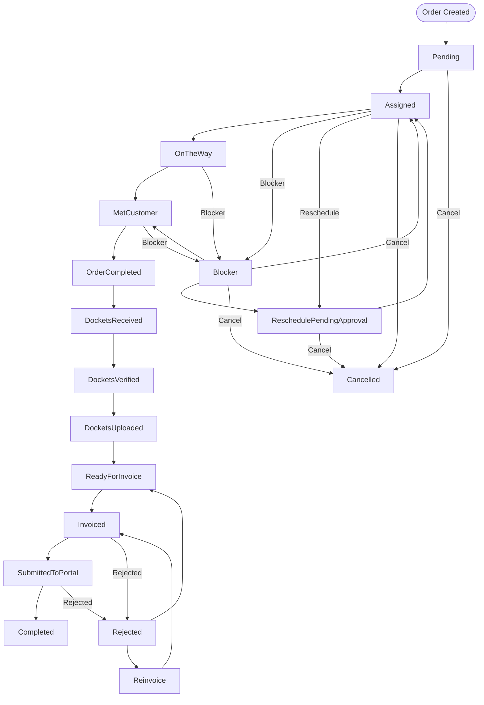

# Workflow: Order Lifecycle (Complete Journey)

**File:** `docs/01_system/21_workflow_order_lifecycle.md`  
**Purpose:** Complete order lifecycle from creation to payment, aligned with the canonical workflow status reference and database seed.

> **Authority:** This document matches [WORKFLOW_STATUS_REFERENCE.md](../05_data_model/WORKFLOW_STATUS_REFERENCE.md) (17 order statuses) and the seeded transitions in [07_gpon_order_workflow.sql](../backend/scripts/postgresql-seeds/07_gpon_order_workflow.sql). All status names and the lifecycle flow below are identical to the reference.  
> **InProgress:** Not a valid order status. It does not exist in the canonical workflow status reference or in the database workflow seed. Earlier workflow documentation sometimes used "InProgress"; the canonical fieldwork flow is **Assigned → OnTheWay → MetCustomer → OrderCompleted** (no InProgress step).

---

## Order Workflow Statuses (17 Total)

### Main Flow (12 statuses)

| Order | Code | Display Name |
|-------|------|--------------|
| 1 | `Pending` | Pending |
| 2 | `Assigned` | Assigned |
| 3 | `OnTheWay` | On The Way |
| 4 | `MetCustomer` | Met Customer |
| 5 | `OrderCompleted` | Order Completed |
| 6 | `DocketsReceived` | Dockets Received |
| 7 | `DocketsVerified` | Dockets Verified |
| 8 | `DocketsUploaded` | Dockets Uploaded |
| 9 | `ReadyForInvoice` | Ready For Invoice |
| 10 | `Invoiced` | Invoiced |
| 11 | `SubmittedToPortal` | Submitted To Portal |
| 12 | `Completed` | Completed |

### Side States (5 statuses)

| Code | Display Name |
|------|--------------|
| `Blocker` | Blocker |
| `ReschedulePendingApproval` | Reschedule Pending Approval |
| `Rejected` | Rejected |
| `Cancelled` | Cancelled |
| `Reinvoice` | Reinvoice |

---

## Standard Order Flow

```
Pending
  ↓
Assigned
  ↓
OnTheWay
  ↓
MetCustomer
  ↓
OrderCompleted
  ↓
DocketsReceived
  ↓
DocketsVerified
  ↓
DocketsUploaded
  ↓
ReadyForInvoice
  ↓
Invoiced
  ↓
SubmittedToPortal
  ↓
Completed
```

---

## Side Paths (per canonical reference)

**Blocker path:** Can occur from `Assigned`, `OnTheWay`, `MetCustomer`. Can transition to `MetCustomer`, `ReschedulePendingApproval`, `Cancelled`.

**Reschedule path:** Can occur from `Assigned`, `Blocker`. Can transition to `Assigned`, `Cancelled`.

**Cancellation path:** Can occur from `Pending`, `Assigned`, `Blocker`, `ReschedulePendingApproval`. Terminal state (no further transitions).

**Reinvoice path:** Can occur from `Invoiced`, `SubmittedToPortal`. Can transition back to `Invoiced` (with new submission ID).

---

## Diagram: Order Status Lifecycle (Main Flow)



---

## Deprecated or non-canonical statuses

- **InProgress:** Was used in earlier workflow documentation but is not part of the canonical workflow status reference or seeded workflow transitions. Do not use. The fieldwork sequence is Assigned → OnTheWay → MetCustomer → OrderCompleted.

---

## Enforcement (application guard)

Transitions are **enforced in application code** as well as by the DB workflow:

- **SiWorkflowGuard** (see [SI_APP_WORKFLOW_HARDENING_REPORT.md](../../backend/docs/operations/SI_APP_WORKFLOW_HARDENING_REPORT.md)) allows only the canonical transition set. Invalid jumps (e.g. Assigned → Completed, Assigned → MetCustomer, OnTheWay → OrderCompleted) are **rejected** with a clear error listing allowed next statuses.
- **Duplicate / no-op:** Requesting a transition to the order’s current status (e.g. Assigned → Assigned) is rejected; no workflow job or side effects run.
- **Completion:** OrderCompleted is only allowed from MetCustomer; Completed only from SubmittedToPortal. Completion cannot skip the prior customer-met milestone.
- **Reschedule:** Transition to ReschedulePendingApproval **requires a non-empty Reason** (e.g. customer request, building issue) for auditability.
- **Blocker:** Blocker transitions continue to use BlockerValidationService (reason and category). Blocker and reschedule flows follow the seeded workflow; ad hoc jumps are not allowed.

Both the Orders API (OrderService) and the workflow engine (WorkflowEngineService) apply this guard for Order entity type.

---

## Conformance

- Status names match [WORKFLOW_STATUS_REFERENCE.md](../05_data_model/WORKFLOW_STATUS_REFERENCE.md) exactly (PascalCase, case-sensitive).
- Lifecycle flow matches the canonical reference and [07_gpon_order_workflow.sql](../backend/scripts/postgresql-seeds/07_gpon_order_workflow.sql).
- No undocumented statuses are used in this document.

---

**Related:**
- [WORKFLOW_STATUS_REFERENCE.md](../05_data_model/WORKFLOW_STATUS_REFERENCE.md) — Single source of truth for status codes and naming
- [21_workflow_order_lifecycle.md](../architecture/21_workflow_order_lifecycle.md) — Extended diagrams and sequence flows
- [PLATFORM_SAFETY_HARDENING_INDEX.md](../../backend/docs/operations/PLATFORM_SAFETY_HARDENING_INDEX.md) — Index of platform safeguards (tenant, financial, EventStore, observability, SI workflow)
