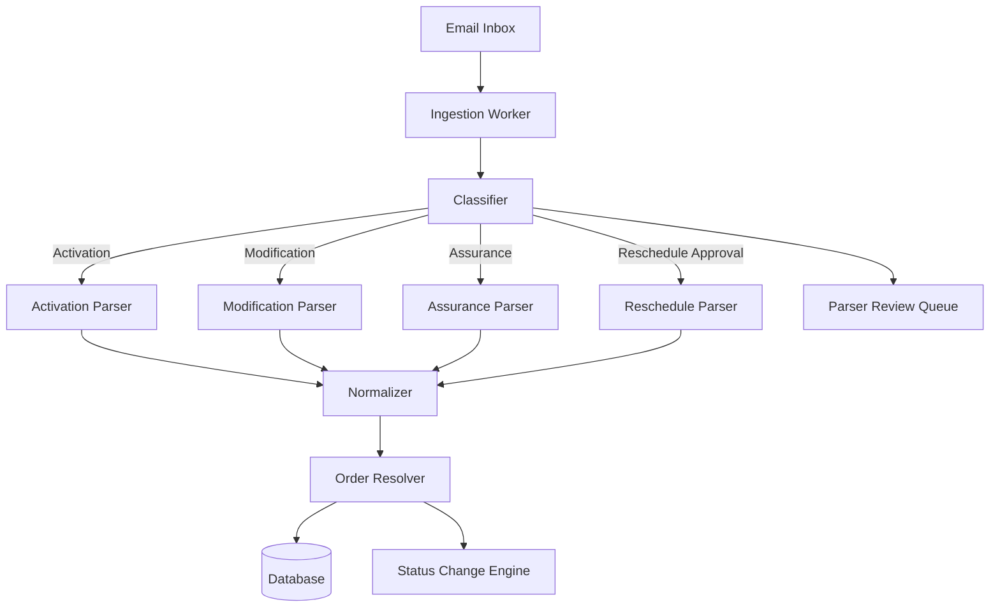

# EMAIL_PIPELINE.md — Full Production Architecture

This file describes the **complete architecture of the CephasOps Email Processing Pipeline**, explaining how we ingest, classify, parse, normalise, enrich, and finally convert incoming emails (and their attachments) into orders and updates.

The pipeline is built for **100% automation**, low latency, accuracy, and reliability across multiple TIME partners.

---

## 1. High-Level Overview

The Email Pipeline performs six core responsibilities:

1. **Ingest emails** from connected mailboxes
2. **Classify** emails by partner, type, and intent
3. **Extract** structured data from body/attachments
4. **Normalise** the extracted data
5. **Map** data to new or existing orders
6. **Trigger** lifecycle transitions (e.g., reschedule approval)

### Pipeline Flow

```
Email Inbox
    ↓
Ingestion Worker
    ↓
Classifier
    ↓
Parser Engine
    ↓
Normalizer
    ↓
Order Resolver
    ↓
Database + Status Changes
```

---

## 2. Multi-Tenant, Multi-Department Architecture

CephasOps operates as a **multi-tenant SaaS platform** with per-company data isolation and multiple departments per tenant:

- **Company**: One root company (Cephas Ops)
- **Departments**: GPON (active), CWO (future), NWO (future)
- **Partner Groups**: TIME Group, Direct Customers, etc.
- **Partners**: TIME FTTH, TIME FTTO, Digi, Celcom, U-Mobile, etc.

### Email Routing Model

```
Email Account (Mailbox)
    ↓
Email Rule (optional filtering)
    ↓
Department Assignment (GPON, CWO, NWO)
    ↓
Parser Template Selection
    ↓
Order Creation/Update
    ↓
Department-Specific Workflow
```

Each department can have:

- Its own email inboxes
- Its own parser templates
- Its own workflow definitions
- Shared underlying parser engine

### Current State

- **GPON Department**: Fully active with email automation
- **CWO Department**: Reserved for future use
- **NWO Department**: Reserved for future use

---

## 3. Ingestion Worker (Email Fetcher)

### Schedule

Runs every 60 seconds (configurable per EmailAccount):

```
cron: */1 * * * *
```

### Supported Providers

- IMAP
- Microsoft Graph (Outlook 365)
- POP3 (fallback)
- Google Workspace IMAP

### Process

For each email:

1. Fetch metadata: sender, subject, message-ID, thread-ID
2. Download attachments
3. Convert `.msg` → `.eml` → HTML (if needed)
4. Extract raw HTML body

### Storage

Store raw email in `email_raw` table:

```json
{
  "emailId": "...",
  "from": "...",
  "to": "...",
  "cc": "...",
  "subject": "...",
  "bodyHtml": "...",
  "attachments": [],
  "receivedAt": "...",
  "processed": false
}
```

### Mailbox Configuration

Each mailbox is configured under **Settings → Email → Mailboxes** with:

- Email address and credentials
- Provider type (IMAP/POP3/Graph)
- Poll interval (default: 15 minutes)
- **Default Department** - Routes emails to this department
- **Default Parser Template** - Which parser to use
- SMTP settings for outbound replies

**Department Assignment**: Each mailbox must specify which department it serves. This allows:

- GPON mailbox for TIME/Digi/Celcom activations
- Future CWO mailbox for civil works orders
- Future NWO mailbox for network operations

---

## 4. Classification Stage (Partner + Intent Detection)

Classifier reads **FROM, SUBJECT, BODY** and determines:

### 4.1 Partner Group Detection

- TIME
- TIMEDIGI
- TIMECELCOM
- TIMEUMOBILE
- DIRECT

### 4.2 Order Type (Intent)

- Activation
- Modification Indoor
- Modification Outdoor
- Assurance
- SDU
- Reschedule Approval

### 4.3 Confidence Score (0–1)

Each classification outputs:

```json
{
  "partnerGroup": "TIMEDIGI",
  "orderType": "Activation",
  "confidence": 0.98
}
```

If confidence < 0.75 → send email to Parser Review queue.

### 4.4 Department Routing

Email classification maps through this hierarchy:

```
Partner → Partner Group → Department → Parser Template
```

- **Partner** identifies who sent the email (TIME FTTH, Digi, Celcom)
- **Partner Group** provides logical grouping (TIME Group)
- **Department** determines which workflow/lifecycle to use (GPON, CWO, NWO)
- **Parser Template** defines how to extract data

**Current routing:**

All current partners (CELCOM, DIGI, TIME FTTH, TIME FTTO, U-MOBILE) belong to **GPON Department**. Future CWO or NWO emails will route to their own parser sets and workflows.

### 4.5 Partner ID Resolution

The parser normalizes incoming partner identifiers and maps them to internal Partner records:

- Partner Name → Internal Partner entity
- Email domain → Partner (e.g., `@digi.com.my` → Digi partner)
- Partner codes (DIGI0016775, CELCOM0016996) → Internal Partner
- Order type → Partner + Department combination

This ensures all emails are correctly attributed regardless of format variations.

---

## 5. Attachment Processor

Attachments may include:

- `.xls`
- `.xlsx`
- `.pdf`
- `.msg`
- `.htm`

### 5.1 Excel Processor

- Flexible column name matching
- Handles shifted columns
- Handles merged cells
- Handles header shifts in Digi/Celcom formats

### 5.2 PDF Processor

Used only for:

- Converted XLS→PDF activations
- Celcom approvals sometimes in PDF
- Old TIME format

### 5.3 HTML Processor

Every `.msg` is converted to `.eml` & extracted HTML.

---

## 6. Body Processor (Non-Excel)

Used for:

- Assurance TTKT emails
- Reschedule approvals
- Human-written free-form emails

### 6.1 TTKT Block Detector

Extracts:

- Customer Name:
- Service ID:
- TTID:
- Issue:
- Appointment:
- URL:

### 6.2 Approval NLP Detector

Uses keyword-weight mapping:

```
["approved", "proceed", "new appointment", "slot booked", "rescheduled", "ok noted"]
```

### 6.3 Date/Time NLP Engine

Understands:

- `29 Nov 11am`
- `Tomorrow 2pm`
- `Friday morning`
- `25/11 – slot 10-12`

---

## 7. Parser Engine

After attachment/body extraction → data fed into parser.

### Parser Templates

Parser Templates are configured under **Settings → Email → Parser Templates**. Each template defines:

- Partner association (TIME FTTH, Digi, Celcom, etc.)
- Field mappings (Excel column → CephasOps field)
- Extraction rules (regex, keywords, NLP)
- Validation requirements
- Department routing

**Parser Template Grouping**: Templates can be grouped under Partner Group for inheritance. This allows:

- TIME Group base template shared by TIME FTTH, TIME FTTO, TIME Assurance
- Partner-specific overrides (Digi HSBB has different columns than TIME FTTH)
- Reduced duplication across similar partner formats

### Available Parsers

- TIME Activation Parser
- Digi HSBB Parser
- Celcom HSBB Parser
- Modification Parser
- Assurance Parser
- Reschedule Parser

### Parser Requirements

Parsers MUST:

- Map fields to CephasOps JSON
- Fill `partnerOrderType`
- Validate mandatory fields
- Auto-fix customer contact
- Normalise address
- Normalise date/time
- Standardise case

---

## 8. Normalizer

Ensures data meets internal standards.

### 8.1 Contact Number Normalization

Examples:

- `+60122334455` → `0122334455`
- `122164657` → `0122164657`
- `016-663-9910` → `0166639910`

### 8.2 Address Standardization

- Remove trailing commas
- Extract unit/block/floor/building
- Convert "Jalan" → "Jln" (optional future rule)

### 8.3 Date/Time Standardization

Converted to:

```
YYYY-MM-DD HH:mm
```

### 8.4 Partner ID Normalization

- Digi → `DIGI0016775`
- Celcom → `CELCOM0016996`

Parser normalizes incoming partner identifiers (e.g., Name, codes, email domain) and maps them to internal Partner records.

---

## 9. Order Resolver (New vs Update)

This engine decides whether the email:

- Creates a **NEW** order, OR
- Updates an **EXISTING** order

### Matching Rules

- Service ID
- Partner Order ID
- TTKT
- Exact customer + address
- Thread ID (Reschedule)

### Update Scenarios

- Reschedule approval
- Duplicate activation email
- Appointment revision
- Customer detail correction
- Contact update
- Modified Excel version from partner

---

## 10. Error & Exception Handling

### If critical fields missing:

- Move to `email_error_queue`
- System notifies admin: "Parser failed — Review Required"

### If Excel unreadable:

Attempt fallback:

- Convert to CSV
- Convert to HTML
- OCR PDF

### If order type ambiguous:

- Add to review state
- Do not create incorrect orders

---

## 11. Pipeline Performance

### SLA Requirements

- Email → Order creation must complete within 10 seconds
- Reschedule approval must update order within 5 seconds
- No duplicated orders
- Parser accuracy ≥ 98%

### Workers

- Multi-threaded
- Scales horizontally in Docker

---

## 12. Logging Structure

Every email processed generates:

```json
email_log {
  emailId,
  classificationResult,
  parsedJson,
  orderId,
  status,
  errors[],
  processedAt
}
```

Every parser error generates:

```json
parser_error_log {
  emailId,
  errorMessage,
  rawContent,
  parserType,
  timestamp
}
```

Every order update generates:

```json
order_update_log {
  orderId,
  action,
  oldValue,
  newValue,
  sourceEmailId,
  timestamp
}
```

---

## 13. Security Considerations

- All emails stored encrypted at-rest
- Attachments sanitized
- No external execution of macros in Excel
- Sanitise HTML → block scripts
- Validate URLs (especially IPTV links)
- Logs omit sensitive fields

---

## 14. Queueing Model

Pipeline may use:

- Redis Streams
- RabbitMQ
- or internal async job scheduler

### Queues

- `email_ingest_queue`
- `email_parse_queue`
- `reschedule_queue`
- `parser_review_queue`
- `error_queue`

---

## 15. Pipeline Diagram (Mermaid)



---

## 16. End of Email Pipeline Specification

This document defines the complete pipeline that ensures all partner emails flow safely and accurately into CephasOps.

It must be implemented consistently between:

- Email ingestion worker
- Parser service
- Backend API
- Workflow engine
- Admin Dashboard

---

**Related Documentation:**

- [WORKFLOW_ENGINE.md](./WORKFLOW_ENGINE.md) - How parsed events trigger workflow transitions
- [../02_modules/email_parser/OVERVIEW.md](../02_modules/email_parser/OVERVIEW.md) - Parser module details
- [../02_modules/email_parser/SPECIFICATION.md](../02_modules/email_parser/SPECIFICATION.md) - Detailed parsing rules
- [SYSTEM_OVERVIEW.md](./SYSTEM_OVERVIEW.md) - Overall system architecture

---

**END OF EMAIL_PIPELINE.md**
