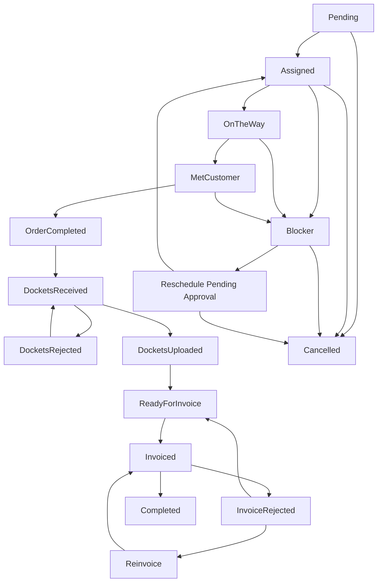

# WORKFLOW_ENGINE.md — Full Production Specification (v2.0)

This module defines the **complete workflow logic** for CephasOps.  
It coordinates order lifecycle, status transitions, splitter enforcement, material movements, rescheduling, dockets, invoicing, and payment handling.

This is the **source of truth** for backend workflow rules and UI restrictions.

> NOTE: All status names and meanings **must match** `ORDER_LIFECYCLE.md`.  
> This file explains **how** transitions happen and **which rules** are enforced.

---

## 1. Scope of the Workflow Engine

The Workflow Engine governs:

1. **Allowed status transitions**
2. **Required validations before each transition**
3. **Automatic actions performed on every change**
4. **Event logging and audit trails**
5. **Cross-module workflows:**
   - Email parser (orders, reschedules, rejections)
   - Inventory / materials
   - Splitter usage
   - Dockets
   - Invoicing
   - Payments
   - KPI hooks (SI vs Admin KPI signals)
6. **Permissions and overrides:**
   - SI vs Admin vs HOD/SuperAdmin
   - TIME X Portal manual mirroring
   - HOD/SuperAdmin override with evidence

The engine guarantees **consistency, accuracy, accountability** and ensures CephasOps follows internal policy and partner requirements.

---

## 2. Status Model (Central to Workflow)

### 2.1 Department Scope

This workflow engine applies to **GPON orders**. The engine is modular and allows different workflows based on department:

- **GPON Department**: Uses the full lifecycle defined in this document (active in v1)
- **CWO Department**: Will use department-specific workflow when activated (future)
- **NWO Department**: Will use department-specific workflow when activated (future)

Each department can define its own lifecycle transitions, validations, and rules through the Workflow Definitions configuration.

### 2.2 Department vs Partner Group

The Workflow Engine uses **Department** (not Partner Group) to select the lifecycle and rules:

- **Department** → Controls which workflow definition applies, validates transitions, enforces business rules
- **Partner Group** → Used only for email routing and parser template selection in the Email Pipeline
- **Partner** → Individual partner configuration, may have partner-specific overrides

Example: TIME, Digi, and Celcom partners all belong to the TIME Partner Group for email routing, but their orders are processed through the GPON Department workflow.

### 2.3 Status List

The engine uses these statuses (defined in detail in `ORDER_LIFECYCLE.md`):

- `Pending`
- `Assigned`
- `OnTheWay`
- `MetCustomer`
- `Blocker` (Pre-Customer / Post-Customer, encoded via reason/timing)
- `ReschedulePendingApproval`
- `OrderCompleted`
- `DocketsReceived`
- `DocketsRejected`
- `DocketsUploaded`
- `ReadyForInvoice`
- `Invoiced`
- `InvoiceRejected`
- `Reinvoice`
- `Completed`
- `Cancelled`

No generic `Rejected` state exists. Rejections are **specific**:

- Docket-level issues → `DocketsRejected`
- Invoice-level issues → `InvoiceRejected`

### 2.4 Trigger Sources

Status transitions can be triggered by multiple sources:

1. **SI Actions** - Field installer using mobile app (OnTheWay, MetCustomer, OrderCompleted)
2. **Admin Actions** - Office staff using admin portal (Assign, Reschedule, Docket verification, Invoicing)
3. **Parser Events** - Email Pipeline sending structured events (Order creation, Reschedule approvals, Invoice rejections)
4. **TIME X Portal Manual Mirror** - Admin mirroring status changes from TIME portal with evidence
5. **System Actions** - Automated transitions based on business rules

### 2.5 Workflow Activation Rules

The workflow engine uses **workflow definitions** to determine which workflow applies to a given entity. The activation logic follows a priority-based resolution system:

#### 2.5.1 Activation Criteria

A workflow definition is **active** when:
- `IsActive = true` (explicitly enabled)
- `EntityType` matches the target entity (e.g., "Order", "Invoice")
- `CompanyId` matches the current company context (single-company mode)

#### 2.5.2 Resolution Priority

When resolving which workflow to use for an entity, the system follows this priority order (see also `docs/WORKFLOW_RESOLUTION_RULES.md`):

1. **Partner-Specific Workflow** (Most specific)
   - Matches: `EntityType` + `CompanyId` + `PartnerId` + `IsActive = true`
   - Example: TIME-specific order workflow for TIME partners
   - Used when: A partner requires custom workflow rules

2. **Department-Specific Workflow**
   - Matches: `EntityType` + `CompanyId` + `DepartmentId`, with `PartnerId = null` + `IsActive = true`
   - Example: GPON department order workflow
   - Used when: No partner match; department-specific workflow exists

3. **Order-Type-Specific Workflow** (Orders only; uses **parent** order type code when the selected type is a subtype)
   - Matches: `EntityType` + `CompanyId` + `OrderTypeCode`, with `PartnerId = null`, `DepartmentId = null` + `IsActive = true`
   - Example: Workflow for OrderTypeCode = "MODIFICATION" (used for MODIFICATION_OUTDOOR, MODIFICATION_INDOOR, etc.)
   - For Orders: OrderTypeCode is resolved from the order’s OrderType: if it has a parent, use parent’s `Code`; else use the type’s own `Code`.

4. **General Workflow** (Fallback)
   - Matches: `EntityType` + `CompanyId` + `PartnerId = null` + `DepartmentId = null` + `OrderTypeCode = null` + `IsActive = true`
   - Example: Default order workflow for all partners/departments/order types
   - Used when: No more specific workflow exists. Existing workflows with no scope (all null) remain valid as general fallback (backward compatible).

#### 2.5.3 Department-Specific Workflows

Workflow definitions can optionally include a `DepartmentId` to create department-specific workflows:

- **Department-Specific**: `EntityType` + `DepartmentId` + `PartnerId` (optional) + `IsActive = true`
- **General Department**: `EntityType` + `DepartmentId` + `PartnerId = null` + `IsActive = true`
- **Company-Wide**: `EntityType` + `DepartmentId = null` + `PartnerId = null` + `IsActive = true`

**Note:** Currently, department-specific workflow resolution is not implemented in `GetEffectiveWorkflowDefinitionAsync()`. This is a future enhancement.

#### 2.5.4 Activation Requirements

Before a workflow can be activated:

1. **All Required Transitions Must Be Defined**
   - The workflow must have at least one transition defined
   - Transitions must cover all expected status changes for the entity type

2. **IsActive Flag Must Be Set**
   - Only workflows with `IsActive = true` are considered
   - Deactivated workflows (`IsActive = false`) are ignored

3. **Entity Type Must Match**
   - The workflow's `EntityType` must exactly match the entity being processed
   - Example: "Order" workflow only applies to `Order` entities

#### 2.5.5 Workflow Resolution Example

**Scenario:** Processing an Order for TIME partner

1. System calls `GetEffectiveWorkflowDefinitionAsync(companyId, "Order", timePartnerId)`
2. First, searches for: `EntityType = "Order"` AND `PartnerId = timePartnerId` AND `IsActive = true`
3. If found → Use TIME-specific workflow
4. If not found → Search for: `EntityType = "Order"` AND `PartnerId = null` AND `IsActive = true`
5. If found → Use general order workflow
6. If not found → Return `null` (no workflow available, transition will fail)

#### 2.5.6 Multiple Active Workflows

**Rule:** Only **one active workflow** per `(EntityType, PartnerId)` combination should exist.

- If multiple workflows match the same criteria, the first one found (by database query order) is used
- **Best Practice:** Ensure only one workflow is active per entity type and partner combination
- **Validation:** Consider adding database constraints or validation rules to prevent duplicate active workflows

#### 2.5.7 Workflow Deactivation

To deactivate a workflow:

1. Set `IsActive = false` on the `WorkflowDefinition`
2. The workflow will no longer be returned by `GetEffectiveWorkflowDefinitionAsync()`
3. Existing entities using the workflow will continue to use it until a new workflow is activated
4. **Note:** Consider workflow versioning or migration strategies for production systems

#### 2.5.8 Implementation Details

The activation logic is implemented in:
- **Service:** `WorkflowDefinitionsService.GetEffectiveWorkflowDefinitionAsync()`
- **Location:** `backend/src/CephasOps.Application/Workflow/Services/WorkflowDefinitionsService.cs`
- **Method:** Lines 118-156

**Code Flow:**
```csharp
1. Filter by EntityType and IsActive = true
2. If partnerId provided:
   a. Try to find partner-specific workflow
   b. If not found, fallback to general workflow (PartnerId = null)
3. Return first matching workflow or null
```

#### 2.5.9 Order workflow resolution at runtime

- **Orders do not store WorkflowDefinitionId.** The order entity has no foreign key to a workflow definition; workflow is **resolved at each transition** (status change), not at order creation.
- **Partner-specific workflow is used consistently.** When an order status is changed, the engine resolves the effective workflow using the order’s PartnerId (passed in `ExecuteTransitionDto.PartnerId` by callers, or resolved from the order when not provided). The same resolution is used for **execution** (ExecuteTransitionAsync) and for **allowed transitions** (GetAllowedTransitionsAsync, CanTransitionAsync), so the UI and execution always use the same workflow.
- **Order Type, Order Category, and Installation Method are NOT part of workflow resolution.** Only CompanyId, EntityType, and PartnerId are used. Order Type / Category / Installation Method are order attributes used elsewhere (e.g. materials, rates); they do not select the workflow definition.


## 3. Master Status Transition Table

This table shows **normal** (non-override) transitions allowed by the engine.

| FROM                         | TO                             | Allowed? | Who / How                                                                 |
|------------------------------|---------------------------------|----------|---------------------------------------------------------------------------|
| Pending                      | Assigned                       | YES      | Admin assigns SI                                                          |
| Assigned                     | OnTheWay                       | YES      | SI (or Admin via TIME X Portal manual mirror)                            |
| OnTheWay                     | MetCustomer                    | YES      | SI (or Admin via TIME X Portal manual mirror)                            |
| Assigned / OnTheWay          | Blocker (Pre-Customer)         | YES      | SI / Admin, if valid Pre-Customer blocker reason                         |
| MetCustomer                  | Blocker (Post-Customer)        | YES      | SI / Admin, if valid Post-Customer blocker reason                        |
| Blocker                      | ReschedulePendingApproval      | YES      | Admin chooses “Request Reschedule”                                       |
| Blocker                      | Assigned                       | YES      | Admin chooses “Retry / Issue Resolved”                                   |
| MetCustomer                  | ReschedulePendingApproval      | YES      | Admin (customer wants reschedule, non same-day)                          |
| Assigned / OTW / MetCustomer | Assigned (same-day reschedule) | YES      | SI/Admin with customer evidence (same calendar day)                      |
| MetCustomer                  | OrderCompleted                 | YES      | SI completion (or Admin mirror from TIME X Portal)                       |
| OrderCompleted               | DocketsReceived                | YES      | Admin receives docket (physical/WhatsApp/email/SI app)                   |
| DocketsReceived              | DocketsRejected                | YES      | Admin rejects docket (SI submitted wrong/invalid data)                   |
| DocketsRejected              | DocketsReceived                | YES      | SI resubmits / Admin re-verifies corrected docket                        |
| DocketsReceived              | DocketsUploaded                | YES      | Admin uploads valid docket to TIME portal                                |
| DocketsUploaded              | ReadyForInvoice                | YES      | System validates splitter/ONU/photos; docket fully accepted internally   |
| ReadyForInvoice              | Invoiced                       | YES      | Admin uploads invoice to TIME portal + submission ID                     |
| Invoiced                     | InvoiceRejected                | YES      | TIME rejects invoice (portal & email)                                    |
| InvoiceRejected              | ReadyForInvoice                | YES      | Admin regenerates invoice (full correction flow)                         |
| InvoiceRejected              | Reinvoice                      | YES      | Admin performs correction-only path (portal-side edit flow)              |
| Reinvoice                    | Invoiced                       | YES      | Admin re-submits / finalises corrected invoice in portal                 |
| Invoiced                     | Completed                      | YES      | Payment received & recorded                                              |
| Any (pre-invoice)            | Cancelled                      | YES      | Customer/TIME/Building cancellation before invoicing                     |

> **Note:**  
> HOD / SuperAdmin can bypass some of these restrictions via **override**, but every override requires **reason, remark & evidence** (see Section 11).

---

## 4. Validation Engine (Core Rules Before Status Changes)

The Workflow Engine runs **validation blocks** before allowing a status change.  
Each block either **passes** or **blocks** the transition (unless overridden by HOD/SuperAdmin).

---

### 4.1 Before `Assigned`

Required:

- `serviceId` or `partnerOrderId` present  
- `appointment.date` and `appointment.time` set  
- At least one SI assigned  
- Building selected  
- Materials list generated (or confirmed empty for assurance-only jobs)

If any missing → **BLOCK**.

---

### 4.2 Before `OnTheWay`

Rules:

- Current status must be `Assigned`  
- Triggered by SI App, or Admin mirroring TIME X Portal  
- Optional rule: OnTheWay limited to a configurable time window around appointment

If SI → GPS & timestamp recorded.  
If Admin (TIME X Portal mirror) → `source = "TimeXPortalManual"` and **remark required**.

---

### 4.3 Before `MetCustomer`

Rules:

- Current status must be:
  - `OnTheWay`, OR  
  - `Assigned` (if TIME X portal jumps directly to MetCustomer and Admin mirrors)  

If SI → GPS & timestamp recorded.  
If Admin → remark required.

---

### 4.4 Before `Blocker`

Rules:

- Current status must be:
  - `Assigned` or `OnTheWay` for **Pre-Customer Blocker**  
  - `MetCustomer` for **Post-Customer Blocker**
- Blocker reason must be allowed for that timing (see Blocker Matrix in `ORDER_LIFECYCLE.md`)

Required fields:

```jsonc
blocker.category     // Customer | Building | Network | Technical
blocker.reason       // controlled list
blocker.remark       // free text
blocker.timestamp    // auto
blocker.reportedBy   // "SI App" | "Admin"
blocker.evidence[]   // SI = at least 1 photo
gps                  // SI App (auto)
```

If reason not allowed for that timing (e.g. "Building access" after MetCustomer) → **BLOCK**.

---

### 4.5 Before `ReschedulePendingApproval` (Normal Reschedule)

Rules:

- Initiated by Admin (not SI)
- Used for non same-day reschedules
- TIME approval via email required later

Required:

```jsonc
appointment.proposedDateTime
reschedule.reason
reschedule.remark
```

Upon entering ReschedulePendingApproval:

- Appointment is locked
- SI cannot update order status
- No reassignment allowed until approval processed

---

### 4.6 Before Same-Day Reschedule (Assigned → Assigned)

Rules:

- New appointment must be same calendar day
- Customer requested the change (proof required)
- No TIME approval required (internal rule)

Allowed transitions:

```
Assigned    → Assigned
OnTheWay    → Assigned
MetCustomer → Assigned
```

Required:

```jsonc
sameDayReschedule.reason      = "CustomerRequest"
sameDayReschedule.evidence[]  // WhatsApp, call log, SMS, etc.
sameDayReschedule.oldTime
sameDayReschedule.newTime
sameDayReschedule.timestamp
sameDayReschedule.initiatedBy // "SI" | "Admin"
```

If:
- New date ≠ same day, OR
- No evidence

→ **BLOCK**.

---

### 4.7 Before `OrderCompleted`

Rules:

- Current status must be `MetCustomer`
- SI has completed all on-site work
- Splitter Validation must pass (see Section 8)

Required fields:

```jsonc
splitterUsage.splitterId
splitterUsage.port
completion.onuSerial
completion.photos[]      // required photo set
completion.remark
si.signature
```

Validation:

- Port not already in use (unless HOD override)
- Port belongs to current building
- Port not flagged as faulty
- Port not reserved as standby
- Splitter exists and is mapped correctly

If validation fails → **BLOCK** (HOD/SuperAdmin can override with evidence).

---

### 4.8 Before `DocketsReceived`

Rules:

- Current status must be `OrderCompleted`

Required:

- Completion details fully filled
- SplitterUsage saved
- SI photos uploaded

Admin confirms docket receipt:

```jsonc
docket.received = true
docket.source   = "physical" | "whatsapp" | "email" | "si-app"
docket.receivedTimestamp
```

If completion data incomplete → **BLOCK**.

---

### 4.9 Before `DocketsRejected` (Admin Rejects Docket)

Rules:

- Current status must be `DocketsReceived`

Typical reasons (examples):

- Wrong splitter ID / port
- Wrong ONU serial
- Missing mandatory photos
- Wrong job category / job type
- Docket belongs to another order / SI
- Customer details mismatch
- Signature missing

Required:

```jsonc
docket.rejection.reason   // from controlled list
docket.rejection.remark   // free text
docket.rejection.by       // "Admin" | "HOD"
docket.rejection.at       // timestamp
```

KPI:

- SI KPI (job data accuracy)
- Admin KPI (verification quality)

---

### 4.10 Before `DocketsUploaded`

Rules:

- Current status must be `DocketsReceived`
- Docket must not be currently rejected (i.e. must be re-verified if previously in `DocketsRejected`)

Required:

```jsonc
docket.docketNumber          // REQUIRED
splitterUsage.splitterId     // REQUIRED
splitterUsage.port           // REQUIRED
completion.onuSerial         // REQUIRED
completion.photos[]          // REQUIRED set
```

If port reused/invalid and no override → **BLOCK**.

---

### 4.11 Before `ReadyForInvoice`

Rules:

- `docket.uploaded = true`
- `docket.docketNumber` present
- Completion and splitter usage valid (or overridden by HOD)
- Billing scenario known (TIME principal vs direct)
- **FOR ASSURANCE ORDERS ONLY:**
  - If serialised materials were replaced (ONU, Router, Mesh, ONT):
    - All RMA entries must have `approvedBy` and `approvalNotes` filled
    - TIME approval must be recorded before invoice submission
    - Missing approval → **BLOCK**
  - If non-serialised materials were replaced (patch cord, connector, trunking, clips):
    - At least one replacement row must exist with material type and quantity filled
    - No TIME approval required for non-serialised items

If any missing → **BLOCK**.

---

### 4.12 Before `Invoiced`

Rules:

- Current status must be `ReadyForInvoice` (or `Reinvoice` in correction loop)
- Admin has uploaded invoice to TIME portal

Required:

```jsonc
invoice.submissionId     // REQUIRED
invoice.portalUploadDate // REQUIRED
```

If submissionId missing → **BLOCK**.

On success:

- `invoice.dueDate = portalUploadDate + 45 days`
- Engine updates invoice ageing dashboards

---

### 4.13 Before `InvoiceRejected`

Rules:

- Current status must be `Invoiced`
- TIME / partner has rejected the invoice (email / portal info)

Required:

```jsonc
invoice.rejection.reason   // from controlled list
invoice.rejection.remark   // free text
invoice.rejection.by       // "TIME" | "Partner"
invoice.rejection.at       // timestamp
```

KPI:

- Admin KPI (billing accuracy failure)

---

### 4.14 Before `Reinvoice`

Rules:

- Current status must be `InvoiceRejected`
- Used when invoice can be corrected within portal, not regenerated from scratch

Required:

```js
reinvoice.mode          = "PortalCorrection"
reinvoice.remark
reinvoice.updatedBy
reinvoice.timestamp
```

---

### 4.15 Before `Completed`

Rules:

- Current status must be `Invoiced`
- Payment info recorded by Admin/Finance

Required:

```jsonc
payment.date
payment.amount
payment.reference
payment.method
```

Then engine:

```jsonc
status = "Completed"
invoice.isPaid = true
```

Updates:

- Ageing report
- Revenue data
- Partner payout dashboards

---

## 5. Reschedule Workflow Logic

Reschedule logic:

- **Normal Reschedule** → `ReschedulePendingApproval` (needs TIME email approval)
- **Same-Day Reschedule** → stays in `Assigned` (internal rule)

---

### 5.1 Normal Reschedule (ReschedulePendingApproval)

When Admin clicks Reschedule:

Engine sets:

```jsonc
status = "ReschedulePendingApproval"
appointment.proposedDateTime
reschedule.reason
reschedule.remark
```

Engine locks:

- Appointment (no manual changes)
- SI cannot change status
- No reassignment

Engine generates email template for TIME with:

- Service ID / Partner Order ID
- Old slot
- Proposed slot
- Reason

---

### 5.2 Waiting for TIME Approval

Engine waits for:

- Email from TIME (parsed), OR
- Manual admin action after reading TIME's email

On approval, engine:

```jsonc
appointment.dateTime = approvedSlot
status = "Assigned"

rescheduleHistory[] += {
  previousSlot,
  newSlot,
  approvedBy: "TIME",
  approvedAt: timestamp
}
```

No manual slot change allowed while in `ReschedulePendingApproval`.

---

### 5.3 Same-Day Reschedule (Customer Request Only)

Rules:

- New appointment is same calendar date
- Customer must request it
- Evidence is mandatory

Allowed transitions:

```
Assigned    → Assigned
OnTheWay    → Assigned
MetCustomer → Assigned
```

Required fields (see 4.6).

If different date OR no evidence → **BLOCK**.

---

## 6. Blocker Workflow (Engine Logic)

The engine uses the Blocker Matrix from `ORDER_LIFECYCLE.md`:

- **Pre-Customer Blocker** - Allowed from `Assigned` / `OnTheWay`
- **Post-Customer Blocker** - Allowed from `MetCustomer`

### 6.1 Allowed Flows

```
Assigned / OnTheWay → Blocker (Pre-Customer)
MetCustomer         → Blocker (Post-Customer)

Blocker → Assigned
Blocker → ReschedulePendingApproval
Blocker → Cancelled
```

The Workflow Engine:

- Validates reason vs timing
- Logs evidence (photos, remarks)
- Routes job towards reschedule or closure based on admin action

---

## 7. Material Movement Workflow

(High level – detailed inventory spec should live in `materials.md` or `inventory.md`.)

### 7.1 On `Assigned`

Engine creates a planned allocation:

```
Warehouse → Installer (planned)
```

Based on:

- Building type
- Partner type
- Package / job type

### 7.2 On `OrderCompleted`

Engine converts actual usage:

- **Used materials**: Installer → Customer
- **Unused/returned**: Installer → Warehouse

Writes to:

- `material_movements`
- `job_materials`

### 7.3 Assurance / Swap Cases

If ONU/router swapped:

- **Old ONU**: Customer → Installer → Warehouse
- **New ONU**: Warehouse → Installer → Customer

Engine preserves:

- Full serial trace
- Which job consumed which ONU/router

---

### 7.4 Assurance RMA Workflow (Full Production)

For Assurance (troubleshooting/repair) orders where materials are replaced, the engine enforces RMA tracking and TIME approval requirements.

#### 7.4.1 Serialised Material Replacement (ONU, Router, Mesh, ONT)

**Workflow:**

1. **At `MetCustomer` or later:**
   - SI records old device (material type + serial number)
   - SI records new device (material type + serial number)
   - Fields become editable only after status = `MetCustomer`

2. **Before `ReadyForInvoice`:**
   - Admin must obtain TIME approval (via email/portal/phone)
   - Admin records:
     - `approvedBy` - TIME contact name (REQUIRED)
     - `approvalNotes` - Approval reference/details (REQUIRED)
     - `approvedAt` - Timestamp (auto)
   - **MANDATORY** - Missing approval → **BLOCK** transition to `ReadyForInvoice`

3. **After `ReadyForInvoice`:**
   - RMA fields become read-only
   - RMA data is included in invoice submission

**Validation Rules:**

- Old material ID + serial number must be provided
- New material ID + serial number must be provided
- `approvedBy` cannot be empty if serialised items were replaced
- `approvalNotes` cannot be empty if serialised items were replaced
- Editable only when status ≥ `MetCustomer`
- Locked after status = `ReadyForInvoice`

#### 7.4.2 Non-Serialised Material Replacement (Patch Cord, Connector, Trunking, Clips)

**Workflow:**

1. **At `MetCustomer` or later:**
   - SI/Admin records material type + quantity replaced
   - Optional remark field for context

2. **Before `ReadyForInvoice`:**
   - If any non-serialised items were replaced:
     - At least one replacement row must exist
     - Material type and quantity are required
     - Remark is optional
   - **NO TIME approval required** for non-serialised items

**Validation Rules:**

- Material type must be selected
- Quantity replaced must be > 0
- At least one row required if items were replaced
- No approval workflow needed

#### 7.4.3 RMA Data Model

The engine tracks RMA data in:

- `OrderMaterialReplacement` entity (serialised swaps)
- `OrderNonSerialisedReplacement` entity (non-serial items)

Both linked to the Order via `OrderId`.

#### 7.4.4 RMA Validation in Workflow Engine

**Before `ReadyForInvoice` (Assurance orders only):**

```jsonc
if (order.orderType contains "Assurance") {
  if (hasSerialisedReplacements) {
    foreach (replacement in order.materialReplacements) {
      if (!replacement.approvedBy || !replacement.approvalNotes) {
        BLOCK("Missing TIME approval for RMA replacement");
      }
    }
  }
  if (hasNonSerialisedReplacements) {
    if (order.nonSerialisedReplacements.length === 0) {
      // Allow - may not have replaced anything
    } else {
      foreach (replacement in order.nonSerialisedReplacements) {
        if (!replacement.materialId || replacement.quantityReplaced <= 0) {
          BLOCK("Invalid non-serialised replacement data");
        }
      }
    }
  }
}
```

**Status-Based Field Locking:**

- Status < `MetCustomer`: RMA fields disabled
- Status ≥ `MetCustomer` and < `ReadyForInvoice`: RMA fields editable
- Status ≥ `ReadyForInvoice`: RMA fields read-only

---

## 8. Splitter Workflow (Strict Enforcement + Override)

### 8.1 Standard Validation

By default (for SI/Admin):

Invalid port → **BLOCK** transition to `OrderCompleted` or `DocketsUploaded`

Invalid when:

- Port already in use by another active service
- Port flagged faulty
- Port reserved as standby
- Splitter not mapped to building
- Wrong splitter type

### 8.2 HOD / SuperAdmin Override

Only roles: HOD, SuperAdmin, Director can override.

Required:

```jsonc
override.enabled = true
override.role
override.reason
override.remark
override.evidence[]  // at least 1 attachment
override.timestamp
override.performedBy
```

Engine then:

- Forces port assignment
- Marks port as Used (HOD Override)
- Adds job to Critical Attention Queue
- Writes a dedicated audit entry

---

## 9. Invoicing Workflow

### 9.1 DocketsUploaded → ReadyForInvoice

Engine confirms:

- Docket uploaded
- Docket number present
- Splitter usage valid (or overridden by HOD)
- Completion details valid
- Photos complete
- Billing scenario known

If all pass → `ReadyForInvoice`.  
If not → **BLOCK**.

### 9.2 ReadyForInvoice → Invoiced

Admin uploads invoice to TIME portal.

Engine requires:

```jsonc
invoice.submissionId
invoice.portalUploadDate
```

If submissionId missing → **BLOCK**.

On success:

- `invoice.dueDate = portalUploadDate + 45 days`
- Ageing dashboards updated

### 9.3 Invoiced → InvoiceRejected

Triggered when:

- TIME/partner rejects invoice (email, portal, etc.)

Engine:

- Logs `invoice.rejection.*` fields
- Raises Admin KPI event for invoice failure

### 9.4 InvoiceRejected → ReadyForInvoice (Full Regeneration Path)

Used when invoice needs full regeneration:

- Admin corrects BOQ/BOW / mapping / rate
- New invoice may be generated

Engine:

```jsonc
status = "ReadyForInvoice"
```

KPI: Admin KPI (billing accuracy).

### 9.5 InvoiceRejected → Reinvoice → Invoiced (Portal-Correction Path)

Used when invoice can be corrected inside portal:

1. `InvoiceRejected` → `Reinvoice`
2. Admin updates remark + correction type
3. `Reinvoice` → `Invoiced`
4. Admin re-submits / confirms corrected invoice

KPI: Admin KPI.

## 10. Payment Workflow

When payment is received:

Admin/Finance records:

```js
payment.date
payment.amount
payment.reference
payment.method
```

Engine:

```jsonc
status = "Completed"
invoice.isPaid = true
```

Updates:

- Ageing report
- Revenue data
- Partner payout / KPI dashboards

---

## 10.1 KPI Responsibility Matrix

The Workflow Engine assigns KPI ownership based on which actor is responsible for each transition and outcome:

| Status / Action | Responsible Party | KPI Impact | Reason |
|----------------|-------------------|------------|---------|
| **DocketsRejected** | SI | SI KPI (negative) | Installer submitted incorrect/incomplete job data |
| **InvoiceRejected** | Admin/Clerk | Admin KPI (negative) | Admin submitted incorrect billing data to TIME |
| **ReschedulePendingApproval** | Admin | Admin KPI (neutral/tracking) | Admin coordination with partner for reschedule |
| **Same-Day Reschedule** | SI | SI KPI (tracking) | SI requested appointment change with customer evidence |
| **Blocker (Pre-Customer)** | SI or Admin | Mixed | Depends on blocker reason (building access = SI, wrong address = Admin) |
| **Blocker (Post-Customer)** | SI | SI KPI (tracking) | Technical issues discovered after meeting customer |
| **OnTimeCompletion** | SI | SI KPI (positive) | Job completed within SLA window |
| **LateCompletion** | SI | SI KPI (negative) | Job completed after SLA expiry |
| **DocketTimeliness** | Admin | Admin KPI (tracking) | Time between OrderCompleted and DocketsUploaded |
| **InvoiceTimeliness** | Admin | Admin KPI (tracking) | Time between DocketsUploaded and Invoiced |
| **RMA Approval Timeliness** | Admin | Admin KPI (tracking) | Time between OrderCompleted and TIME approval obtained for serialised replacements |
| **RMA Data Accuracy** | SI | SI KPI (tracking) | Correct old/new serial numbers recorded for material swaps |
| **Missing RMA Approval** | Admin | Admin KPI (negative) | Invoice blocked due to missing TIME approval for serialised material replacement |

This matrix ensures accountability is correctly assigned and KPI dashboards accurately reflect performance across SI, Admin, and Finance roles.

---

## 11. Permissions & Overrides by Role
### 11.1 Normal Permissions

| Action | Admin | SI | Parser | TimeXPortalManual | HOD/SuperAdmin |
|--------|-------|----|----|---------|----------------|
| Create order | ✔ | ✖ | ✔ | ✖ | ✔ |
| Assign SI | ✔ | ✖ | ✖ | ✖ | ✔ |
| Set OnTheWay / MetCustomer | ✖ | ✔ | ✖ | ✔ | ✔ |
| Raise Blocker | ✔ | ✔ | ✖ | ✖ | ✔ |
| Request normal reschedule | ✔ | ✖ | ✖ | ✖ | ✔ |
| Approve reschedule (email) | ✔ | ✖ | ✔ | ✖ | ✔ |
| Same-day reschedule | ✔ | ✔ | ✖ | ✖ | ✔ |
| Mark DocketsReceived | ✔ | ✖ | ✖ | ✖ | ✔ |
| Mark DocketsRejected | ✔ | ✖ | ✖ | ✖ | ✔ |
| Upload docket (DocketsUploaded) | ✔ | ✖ | ✖ | ✖ | ✔ |
| Mark ReadyForInvoice | ✔ | ✖ | ✖ | ✖ | ✔ |
| Upload invoice (Invoiced) | ✔ | ✖ | ✖ | ✖ | ✔ |
| Mark InvoiceRejected | ✔ | ✖ | ✔ | ✖ | ✔ |
| Use Reinvoice flow | ✔ | ✖ | ✖ | ✖ | ✔ |
| Mark payment received | ✔ | ✖ | ✖ | ✖ | ✔ |
| Override validation / force status | ✖ | ✖ | ✖ | ✖ | ✔ |

### 11.2 HOD / SuperAdmin Override Policy

Only HOD, SuperAdmin, Director can:

- Force status changes (rollback, skip)
- Override splitter/port validation
- Bypass missing data (photos, docket, etc.)
- Override blockers
- Override docket/invoice constraints

Every override requires:

```jsonc
override.enabled
override.role
override.reason
override.remark
override.evidence[]
override.timestamp
override.performedBy
```

If reason or evidence missing → **BLOCK** override.

Each override produces a special audit entry:

```jsonc
{
  "type": "StatusOverride",
  "fromStatus": "...",
  "toStatus": "...",
  "performedBy": { "userId": "...", "role": "HOD" },
  "reason": "...",
  "remark": "...",
  "evidenceStored": true,
  "timestamp": "..."
}
```

Shown in:

- `statusHistory[]`
- `auditTrail[]`
- HOD override reports

---

## 12. Error Handling Rules

- Invalid splitter / port → Reject transition to `OrderCompleted` or `DocketsUploaded` (unless override).
- Missing docket → Reject `DocketsReceived` / `DocketsUploaded`.
- Missing submissionId → Reject `Invoiced`.
- Missing TIME approval → Cannot leave `ReschedulePendingApproval` (normal reschedule).
- Invalid blocker reason for timing → Reject `Blocker` change.
- Missing evidence for same-day reschedule → Reject same-day reschedule.
- Trying to skip `DocketsRejected` correction → Reject transitions that bypass `DocketsReceived`.
- Trying to skip `InvoiceRejected` correction → Reject direct `InvoiceRejected` → `Completed`.

All rejected transitions must return:

- A clear error code
- A human-readable reason for UI

---

## 13. Workflow Diagram (Mermaid)

### 13.1 Main Lifecycle Flow



### 13.2 Blocker Timing Diagram

```mermaid
flowchart LR

A[Assigned]
OTW[OnTheWay]
MC[MetCustomer]

BL_PRE[Blocker (Pre-Customer)]
BL_POST[Blocker (Post-Customer)]

A --> BL_PRE
OTW --> BL_PRE

MC --> BL_POST
```

---

## 14. End of Workflow Engine Specification

This document defines exactly how the CephasOps Workflow Engine behaves:

- Which transitions are allowed
- Which validations are enforced
- How blockers work (Pre vs Post)
- How reschedule flows operate
- How splitter and docket rules protect billing
- How `DocketsRejected` and `InvoiceRejected` behave
- How `Reinvoice` fits in
- How HOD/SuperAdmin overrides are controlled

All backend code, frontend flows, and SI mobile app logic must obey this specification.

Any change to the workflow must:

1. Be updated here first
2. Be reviewed & approved
3. Then be implemented in code

---

**Related Documentation:**

- [ORDER_LIFECYCLE.md](./ORDER_LIFECYCLE.md) - Status definitions and business rules
- [EMAIL_PIPELINE.md](./EMAIL_PIPELINE.md) - Parser events and email-triggered transitions
- [SYSTEM_OVERVIEW.md](./SYSTEM_OVERVIEW.md) - Overall system architecture

---

## 15. Debugging Guide

**Updated from:** `backend/scripts/WORKFLOW_DEBUG_GUIDE.md`

This section provides debugging guidance for troubleshooting workflow definitions and transitions.

### 15.1 Verifying Workflow Definitions

#### Database Status
- ✅ WorkflowDefinitions table exists
- ✅ All required columns present
- ✅ Workflows found with correct CompanyId
- ✅ IsActive: true, IsDeleted: false

#### Code Changes Applied
- ✅ Backend service updated to handle `Guid.Empty` (returns all workflows)
- ✅ Backend controller updated to accept `Guid.Empty`
- ✅ Frontend default filter changed to show all workflows
- ✅ Frontend logging added for debugging

### 15.2 Testing Steps

#### 1. Verify API is Running
```powershell
netstat -ano | findstr ":5000"
```
Should show port 5000 is LISTENING.

#### 2. Test API Endpoint (with Auth Token)

Get your auth token from browser:
1. Open DevTools (F12)
2. Go to Application → Local Storage → `http://localhost:5173`
3. Copy the `authToken` value

Test the API:
```powershell
.\backend\scripts\test-workflow-api.ps1 -AuthToken "your-token-here"
```

Or test manually with curl:
```powershell
$token = "your-token-here"
$headers = @{ "Authorization" = "Bearer $token" }
Invoke-RestMethod -Uri "http://localhost:5000/api/workflow-definitions" -Headers $headers
```

#### 3. Check Browser Console

Open the frontend at `http://localhost:5173/workflow/definitions` and check:

**Console Tab:**
- Look for: "Loading workflow definitions with filters:"
- Look for: "Workflow definitions API response:"
- Look for: "Set definitions count:"

**Network Tab:**
- Find request to `/api/workflow-definitions`
- Check Status Code (should be 200)
- Check Response tab - should show array with workflows
- Check Request Headers - should include `Authorization: Bearer ...`

#### 4. Check Backend Logs

Look for these log messages in the API console:
```
Getting workflow definitions for company 00000000-0000-0000-0000-000000000000, entityType: , isActive: 
Found {Count} workflow definitions
```

### 15.3 Expected Results

#### API Response
Should return an array with workflows:
```json
[
  {
    "id": "c423b31b-dd25-4aff-9254-37f2ff721278",
    "name": "Order Workflow",
    "entityType": "Order",
    "companyId": "e668353c-de8b-4c47-bba9-c36efba5cef3",
    "departmentId": null,
    "isActive": true,
    "isDeleted": false,
    ...
  }
]
```

### 15.4 Troubleshooting

#### If workflows don't appear:

1. **Check API Response**
   - Open Network tab in browser
   - Find `/api/workflow-definitions` request
   - Check if response is empty array `[]` or has data

2. **Check Backend Logs**
   - Look for "Found {Count} workflow definitions"
   - If count is 0, check the query execution
   - Check for any errors in the logs

3. **Verify CompanyId**
   - Backend receives `Guid.Empty` from `CurrentUserService`
   - Service should return all workflows when `companyId == Guid.Empty`
   - Check if query filter is being applied correctly

4. **Check Soft Delete Filter**
   - EF Core automatically applies `IsDeleted == false` filter
   - Verify workflow has `IsDeleted = false` in database

5. **Check Frontend Filter**
   - Default filter is now `isActive: undefined` (shows all)
   - If "Active Only" checkbox is checked, uncheck it
   - Try changing Entity Type filter

#### Quick Fixes

**If API returns empty array:**
1. Restart API to ensure latest code is running
2. Check backend logs for query execution
3. Verify database has workflows with `IsDeleted = false`

**If frontend shows empty state:**
1. Check browser console for errors
2. Check Network tab for API response
3. Verify API returned data (not empty array)
4. Check if frontend is filtering out the workflow

---

**END OF WORKFLOW_ENGINE.md**