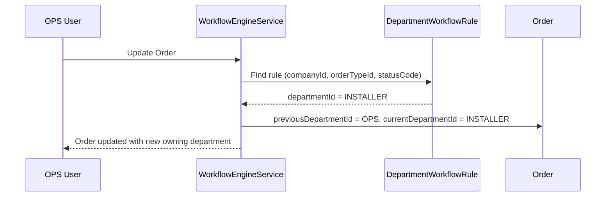

# DEPARTMENT_RELATIONSHIPS.md

## Department Module – Relationships

Departments sit under `Company` and connect to users, orders, workflow rules, materials, billing, KPIs, and background jobs. They are the **spine** for internal responsibility and workflow ownership.

---

## 1. High-Level Diagram

```text
Company
 ├── Department
 │    ├── DepartmentMember (User ↔ Department)
 │    └── DepartmentWorkflowRule (OrderType + Status)
 │
 ├── Order
 │    ├── currentDepartmentId
 │    └── previousDepartmentId
 │
 ├── MaterialMovement
 │    ├── fromDepartmentId
 │    └── toDepartmentId
 │
 ├── BillingRecord / InstallerPayoutRecord
 │    └── departmentId
 │
 └── GlobalSettings (default department, KPI defaults, caps)
```

---

## 2. Company → Department

Relationship: `Company 1 - N Department`

- Departments are always scoped by `companyId`.
- Different companies can reuse codes/names without conflict.
- Parent-child hierarchy is still contained inside the company boundary.

Example:

- Company A → OPS, FIN, WH, INST.
- Company B → PROJECT, FIELD_TEAM, FIN.

---

## 3. Department ↔ DepartmentMember ↔ User

Relationships:

- `Department 1 - N DepartmentMember`
- `User 1 - N DepartmentMember`

This allows:

- One user in multiple departments (primary + secondary teams).
- Department-based filtering of dashboards and workloads.
- Setting `isManager` to drive approvals/escalations.

Example:

- User John → Primary: OPS, Secondary: FIN (for approvals).

---

## 4. DepartmentWorkflowRule → Order Lifecycle

Relationships:

- `Company 1 - N DepartmentWorkflowRule`.
- Each rule targets a `(companyId, orderTypeId, statusCode)` combination.

Runtime behaviour:

1. When an Order’s status changes, Workflow Engine finds a rule ordered by `priority`.
2. If multiple rules match, the lowest priority number wins; if none match, the `isFallback` rule is used, or the company falls back to `GlobalSettings.DefaultDepartmentForNewOrders`.
3. The Order’s `currentDepartmentId` is set to the owning department, and KPIs/queues update accordingly.

Dashboards:

- “My Department’s Orders” view simply filters by `Order.currentDepartmentId`.

---

## 5. Order ↔ Department

Fields on Order:

- `currentDepartmentId`
- `previousDepartmentId`

Relationships:

- `Department 1 - N Order (as current owner)`
- `Department 1 - N Order (as previous owner)`

State transitions:

```
Order status ASSIGNED + dept OPS
  ↓ status changes to ON_THE_WAY
Order previousDept = OPS, currentDept = INSTALLER
  ↓ status changes to READY_FOR_BILLING
Order previousDept = INSTALLER, currentDept = FINANCE
```

This enables:

- Auditing which department held ownership at every stage.
- Department-level SLA, queue length, and load tracking.

---

## 6. Material Movements ↔ Department

Fields on `MaterialMovement`:

- `fromDepartmentId` (nullable)
- `toDepartmentId` (nullable)

Relationships:

- `Department 1 - N MaterialMovement (as fromDepartmentId)`
- `Department 1 - N MaterialMovement (as toDepartmentId)`

Usage examples:

- Warehouse issuing stock to Installer: `from = Warehouse`, `to = Installer`.
- Installer returning unused stock: `from = Installer`, `to = Warehouse`.

This enables material variance and accountability per department.

---

## 7. Billing / Payroll ↔ Department

Fields:

- `BillingRecord.departmentId` (usually FINANCE or BILLING).
- `InstallerPayoutRecord.departmentId` (FINANCE or OPS, depending on who processes payouts).

Purpose:

- Queue views such as “Billing ready for FINANCE” or “Payout approvals for OPS”.
- Tracking SLA breaches in finance queues.

---

## 8. Global Settings Integration

Relevant keys in `GlobalSettingsService`:

- `DefaultDepartmentForNewOrders` – fallback department when no rule matches.
- `DepartmentMaxPerCompany` – hard limit of how many departments a company may create.
- `DepartmentKpiDefaults` – JSON payload describing SLA/KPI targets per department or per status.

These settings ensure the Department layer remains configurable per tenant.

---

## 9. Sequence Diagram – Status → Department Ownership



---

Departments are owned by Company, Users belong via DepartmentMember, DepartmentWorkflowRules map workflow states to departments, and Orders/Materials/Billing reference those departments for ownership, KPIs, and auditability.

