# Code Architecture Audit: Excel Parser (Reference) vs Email Parser (Under Review)

**Date:** 2024-12-19  
**Auditor:** Senior Code Architect  
**Status:** 🔴 Critical Deviations Found

---

## Executive Summary

The Email Parser deviates from the Excel Parser's proven architecture in **3 critical areas** and **2 major areas**. While both parsers correctly use the same Excel parsing service and enrichment service for Excel files, the Email Parser has:

1. **🔴 Critical:** PDF parsing does NOT use the shared enrichment service (duplicated logic)
2. **🔴 Critical:** PDF validation status logic is different from Excel parser
3. **🔴 Critical:** Missing building matching for PDF attachments in email parser
4. **🟡 Major:** Auto-approve parameter handling differs between entry points
5. **🟡 Major:** Error handling patterns differ slightly

**Compliance Score:**
- ✅ Compliant Areas: **65%**
- ❌ Non-Compliant Areas: **25%**
- ⚠️ Areas Needing Review: **10%**

---

## Architecture Flow Comparison

```mermaid
graph TB
    subgraph Excel["Excel Parser Flow (Reference)"]
        E1[Upload Excel File] --> E2[Read File Stream]
        E2 --> E3[ParseExcelFileAsync]
        E3 --> E4[Call _timeExcelParser.ParseAsync]
        E4 --> E5[Map to ParsedOrderDraft]
        E5 --> E6[Call _enrichmentService.EnrichDraftAsync]
        E6 --> E7[Call _enrichmentService.SetValidationStatus]
        E7 --> E8[Save to Database]
    end
    
    subgraph Email["Email Parser Flow (Under Review)"]
        EM1[Connect to IMAP] --> EM2[Read Email + Attachments]
        EM2 --> EM3{Attachment Type?}
        EM3 -->|Excel| EM4[ParseExcelAttachmentAsync]
        EM3 -->|PDF| EM5[ParsePdfAttachmentAsync]
        EM4 --> EM6[Call _timeExcelParser.ParseAsync]
        EM6 --> EM7[Map to ParsedOrderDraft]
        EM7 --> EM8[Call _enrichmentService.EnrichDraftAsync ✅]
        EM8 --> EM9[Call _enrichmentService.SetValidationStatus ✅]
        EM5 --> EM10[Extract PDF Text]
        EM10 --> EM11[Call _pdfOrderParserService.ParseFromText]
        EM11 --> EM12[Map to ParsedOrderDraft]
        EM12 --> EM13[Manual Validation Logic ❌]
        EM13 --> EM14[No Building Matching ❌]
        EM14 --> EM15[Save to Database]
    end
    
    style EM8 fill:#90EE90
    style EM9 fill:#90EE90
    style EM13 fill:#FFB6C1
    style EM14 fill:#FFB6C1
```



**Convergence Point:** Both parsers converge at `_timeExcelParser.ParseAsync` for Excel files, but **diverge for PDF files**.

---

## Deviation Matrix

| Component | Excel Parser (✓) | Email Parser | Status | Action Required |
|-----------|------------------|--------------|--------|-----------------|
| **Excel Parsing Entry** | `ParseExcelFileAsync` | `ParseExcelAttachmentAsync` | ✅ Same Pattern | None |
| **Excel Parser Service** | `_timeExcelParser.ParseAsync` | `_timeExcelParser.ParseAsync` | ✅ Identical | None |
| **Excel Enrichment** | `_enrichmentService.EnrichDraftAsync` | `_enrichmentService.EnrichDraftAsync` | ✅ Identical | None |
| **Excel Validation** | `_enrichmentService.SetValidationStatus(..., false)` | `_enrichmentService.SetValidationStatus(..., autoApprove)` | ⚠️ Parameter Diff | Review autoApprove |
| **PDF Parsing Entry** | `ParsePdfFileAsync` | `ParsePdfAttachmentAsync` | ❌ Different | Align with Excel |
| **PDF Building Matching** | Uses `_buildingMatchingService` via enrichment | **MISSING** | ❌ Critical | Add enrichment |
| **PDF Validation** | Uses enrichment service | Manual logic | ❌ Critical | Use enrichment |
| **Error Handling** | Try-catch with placeholder draft | Try-catch with placeholder draft | ✅ Same Pattern | None |
| **Transaction Management** | SaveChangesAsync after batch | SaveChangesAsync after each | ⚠️ Minor Diff | Review batching |
| **Logging Strategy** | Structured logging | Structured logging | ✅ Same Pattern | None |

---

## Detailed Deviation Analysis

### 🔴 Critical Deviation #1: PDF Parsing Does NOT Use Enrichment Service

**Location:**
- Excel Parser: `ParserService.ParsePdfFileAsync` (lines 1210-1368)
- Email Parser: `EmailIngestionService.ParsePdfAttachmentAsync` (lines 1188-1296)

**Excel Parser (Reference) - Uses Enrichment:**
```csharp
// ParserService.ParsePdfFileAsync
var draft = new ParsedOrderDraft { ... };

// Map parsed data to draft
draft.ServiceId = parsedData.ServiceId;
// ... mapping ...

// BUILDING MATCHING: Uses building matching service
var matchedBuilding = await _buildingMatchingService.FindMatchingBuildingAsync(
    buildingName, draft.AddressText, city, postcode, null, companyId, cancellationToken);

if (matchedBuilding != null)
{
    draft.BuildingId = matchedBuilding.Id;
    draft.BuildingStatus = "Existing";
}
else
{
    // Auto-create building if not found
    var createdBuildingId = await AutoCreateBuildingAsync(...);
    if (createdBuildingId.HasValue)
    {
        draft.BuildingId = createdBuildingId.Value;
        draft.BuildingStatus = "Existing";
    }
    else
    {
        draft.BuildingStatus = "New";
    }
}

// Set validation status
if (parsedData.ConfidenceScore >= 0.7m && !string.IsNullOrEmpty(parsedData.ServiceId))
{
    draft.ValidationStatus = "Pending";
    draft.ValidationNotes = $"Successfully parsed from {file.FileName}...";
}
else
{
    draft.ValidationStatus = "NeedsReview";
    // ... notes ...
}
```

**Email Parser (Under Review) - Manual Logic:**
```csharp
// EmailIngestionService.ParsePdfAttachmentAsync
var draft = new ParsedOrderDraft { ... };

// Map parsed data to draft
draft.ServiceId = parsedData.ServiceId;
// ... mapping ...

// ❌ NO BUILDING MATCHING - Missing entirely!

// Manual validation status (different logic)
if (parsedData.ConfidenceScore >= 0.7m && !string.IsNullOrEmpty(parsedData.ServiceId))
{
    draft.ValidationStatus = autoApprove ? "Valid" : "Pending";  // ❌ Different default
    draft.ValidationNotes = $"Successfully parsed from {file.FileName}...";
}
else
{
    draft.ValidationStatus = "NeedsReview";
    // ... notes ...
}
```

**Impact:**
- Email parser PDF attachments will NOT have building matching
- Email parser PDF attachments will NOT auto-create buildings
- Validation status logic differs (autoApprove vs hardcoded false)
- Code duplication (validation logic exists in both places)

**Fix Required:**
1. Email parser PDF method should call `_enrichmentService.EnrichDraftAsync` (same as Excel)
2. Email parser PDF method should call `_enrichmentService.SetValidationStatus` (same as Excel)
3. Remove manual validation logic from `ParsePdfAttachmentAsync`

---

### 🔴 Critical Deviation #2: Missing Building Matching for PDF Attachments

**Location:**
- Excel Parser: `ParserService.ParsePdfFileAsync` (lines 1282-1331)
- Email Parser: `EmailIngestionService.ParsePdfAttachmentAsync` (lines 1188-1296) - **MISSING**

**Excel Parser (Reference):**
```csharp
// BUILDING MATCHING: Try to match building against existing buildings
try
{
    var (buildingName, city, postcode) = ExtractBuildingInfoFromAddress(draft.AddressText);
    draft.BuildingName = buildingName;
    
    var matchedBuilding = await _buildingMatchingService.FindMatchingBuildingAsync(
        buildingName, draft.AddressText, city, postcode, null, companyId, cancellationToken);
    
    if (matchedBuilding != null)
    {
        draft.BuildingId = matchedBuilding.Id;
        draft.BuildingStatus = "Existing";
    }
    else
    {
        // Auto-create building if not found
        var createdBuildingId = await AutoCreateBuildingAsync(...);
        if (createdBuildingId.HasValue)
        {
            draft.BuildingId = createdBuildingId.Value;
            draft.BuildingStatus = "Existing";
        }
        else
        {
            draft.BuildingStatus = "New";
        }
    }
}
catch (Exception ex)
{
    _logger.LogWarning(ex, "Building matching/creation failed...");
    draft.BuildingStatus = "New";
}
```

**Email Parser (Under Review):**
```csharp
// ❌ NO BUILDING MATCHING CODE EXISTS
// Draft will have BuildingId = null, BuildingStatus = null
```

**Impact:**
- PDF attachments from emails will NOT be matched to existing buildings
- PDF attachments from emails will NOT auto-create buildings
- Inconsistent behavior: Excel attachments get building matching, PDF attachments don't

**Fix Required:**
- Use enrichment service (which handles building matching) OR
- Add building matching logic identical to Excel parser

---

### 🔴 Critical Deviation #3: Different Validation Status Logic for PDF

**Location:**
- Excel Parser: `ParserService.ParsePdfFileAsync` (lines 1334-1354)
- Email Parser: `EmailIngestionService.ParsePdfAttachmentAsync` (lines 1262-1285)

**Excel Parser (Reference):**
```csharp
if (parsedData.ConfidenceScore >= 0.7m && !string.IsNullOrEmpty(parsedData.ServiceId))
{
    draft.ValidationStatus = "Pending";  // Always "Pending" for manual review
    draft.ValidationNotes = $"Successfully parsed from {file.FileName}. Order Type: {parsedData.OrderTypeCode}";
}
else
{
    draft.ValidationStatus = "NeedsReview";
    // ... notes ...
}
```

**Email Parser (Under Review):**
```csharp
if (parsedData.ConfidenceScore >= 0.7m && !string.IsNullOrEmpty(parsedData.ServiceId))
{
    draft.ValidationStatus = autoApprove ? "Valid" : "Pending";  // ❌ Respects autoApprove
    draft.ValidationNotes = $"Successfully parsed from {file.FileName}. Order Type: {parsedData.OrderTypeCode}";
}
else
{
    draft.ValidationStatus = "NeedsReview";
    // ... notes ...
}
```

**Impact:**
- Inconsistent validation status between file upload and email parsing
- Email parser respects `autoApprove` flag, Excel parser doesn't (hardcoded `false`)
- Business logic differs between entry points

**Fix Required:**
- Both should use `_enrichmentService.SetValidationStatus` which handles autoApprove consistently
- Remove manual validation status logic

---

### 🟡 Major Deviation #1: Auto-Approve Parameter Handling

**Location:**
- Excel Parser: `ParserService.ParseExcelFileAsync` calls `SetValidationStatus(..., false)` (line 1188)
- Email Parser: `EmailIngestionService.ParseExcelAttachmentAsync` calls `SetValidationStatus(..., autoApprove)` (line 1173)

**Excel Parser:**
```csharp
_enrichmentService.SetValidationStatus(draft, result, file.FileName, false);  // Hardcoded false
```

**Email Parser:**
```csharp
_enrichmentService.SetValidationStatus(draft, result, file.FileName, autoApprove);  // From template
```

**Analysis:**
- Email parser correctly respects template's `AutoApprove` setting
- Excel parser hardcodes `false` (file uploads always require manual review)
- This is **intentional business logic difference** (file uploads vs emails)
- ✅ **Acceptable** - but should be documented

**Recommendation:**
- Document this difference as intentional business rule
- Consider: Should file uploads also support auto-approve? (Future enhancement)

---

### 🟡 Major Deviation #2: Transaction Batching

**Location:**
- Excel Parser: `ParserService.CreateParseSessionFromFilesAsync` batches saves (line 998)
- Email Parser: `EmailIngestionService.ProcessEmailAsync` saves after each attachment (line 800)

**Excel Parser:**
```csharp
// Process all files, then save once
foreach (var file in files)
{
    var draft = await ParseExcelFileAsync(...);
    _context.ParsedOrderDrafts.Add(draft);
    draftsCreated++;
}
await _context.SaveChangesAsync(cancellationToken);  // Single save
```

**Email Parser:**
```csharp
// Process each attachment, save after each
foreach (var file in attachmentFiles)
{
    var attachmentDraft = await ParseExcelAttachmentAsync(...);
    _context.ParsedOrderDrafts.Add(attachmentDraft);
    draftsFromAttachments++;
}
await _context.SaveChangesAsync(cancellationToken);  // Save after attachments

// Then process body, save again
if (hasBodyContent)
{
    var bodyDraft = new ParsedOrderDraft { ... };
    _context.ParsedOrderDrafts.Add(bodyDraft);
    await _context.SaveChangesAsync(cancellationToken);  // Another save
}
```

**Impact:**
- Email parser has more database round-trips
- Email parser has better error isolation (one attachment failure doesn't rollback others)
- Performance difference is minimal for typical email volumes

**Recommendation:**
- ✅ **Acceptable** - Email parser's approach is actually better for error isolation
- Consider: Document this as intentional design choice

---

## ✅ Compliant Areas (What's Working Well)

### 1. Excel Parsing Architecture
Both parsers use **identical** Excel parsing flow:
- ✅ Same parser service: `_timeExcelParser.ParseAsync`
- ✅ Same enrichment service: `_enrichmentService.EnrichDraftAsync`
- ✅ Same validation service: `_enrichmentService.SetValidationStatus`
- ✅ Same data mapping logic
- ✅ Same error handling pattern

### 2. Service Dependencies
Both parsers inject and use the same services:
- ✅ `ITimeExcelParserService`
- ✅ `IParsedOrderDraftEnrichmentService`
- ✅ `IPdfOrderParserService`
- ✅ `IPdfTextExtractionService`
- ✅ `IFileService`
- ✅ `IBuildingMatchingService` (Excel parser only - see deviation)

### 3. Error Handling Pattern
Both parsers use consistent error handling:
- ✅ Try-catch blocks around parsing
- ✅ Placeholder drafts for failed parsing
- ✅ Structured logging
- ✅ Error messages in `ValidationNotes`

### 4. Database Transaction Patterns
Both parsers:
- ✅ Create `ParseSession` first
- ✅ Add `ParsedOrderDraft` entities
- ✅ Save changes in transaction
- ✅ Update session status on completion/failure

---

## Refactoring Plan

### Phase 1: Extract Common Base (High Priority)

**Goal:** Make PDF parsing use the same enrichment service as Excel parsing.

**Changes Required:**

1. **Update `EmailIngestionService.ParsePdfAttachmentAsync`:**
   ```csharp
   // BEFORE (Current - Manual Logic)
   var draft = new ParsedOrderDraft { ... };
   // ... mapping ...
   // Manual validation status
   draft.ValidationStatus = autoApprove ? "Valid" : "Pending";
   
   // AFTER (Aligned with Excel Parser)
   var draft = new ParsedOrderDraft { ... };
   // ... mapping ...
   
   // Create a parse result DTO (similar to TimeExcelParseResult)
   var parseResult = new TimeExcelParseResult
   {
       Success = true,
       OrderData = new ParsedOrderDataDto
       {
           // Map from parsedData
           ServiceId = parsedData.ServiceId,
           // ... all fields ...
       },
       ConfidenceScore = parsedData.ConfidenceScore
   };
   
   // Use enrichment service (same as Excel parser)
   await _enrichmentService.EnrichDraftAsync(draft, parseResult, file, companyId, cancellationToken);
   _enrichmentService.SetValidationStatus(draft, parseResult, file.FileName, autoApprove);
   ```

2. **Create PDF Parse Result Adapter:**
   - Option A: Create `PdfParseResult` that implements same interface as `TimeExcelParseResult`
   - Option B: Convert `PdfOrderParseResult` to `TimeExcelParseResult` format
   - Option C: Make enrichment service accept both result types (polymorphism)

**Recommended Approach:** Option C - Make enrichment service polymorphic:
```csharp
public interface IParseResult
{
    bool Success { get; }
    decimal ConfidenceScore { get; }
    ParsedOrderDataDto? OrderData { get; }
    List<string>? ValidationErrors { get; }
    string? ErrorMessage { get; }
}

// TimeExcelParseResult implements IParseResult
// PdfOrderParseResult implements IParseResult
// Enrichment service accepts IParseResult
```

**Files to Modify:**
- `EmailIngestionService.ParsePdfAttachmentAsync` (lines 1188-1296)
- `ParsedOrderDraftEnrichmentService.EnrichDraftAsync` (make it accept `IParseResult`)
- `ParsedOrderDraftEnrichmentService.SetValidationStatus` (make it accept `IParseResult`)

---

### Phase 2: Align Email Parser with Excel Parser (Critical)

**Goal:** Make Email Parser PDF handling identical to Excel Parser.

**Changes Required:**

1. **Remove Manual Validation Logic:**
   - Delete lines 1262-1285 in `EmailIngestionService.ParsePdfAttachmentAsync`
   - Replace with enrichment service calls

2. **Add Building Matching:**
   - Ensure enrichment service handles building matching for PDF (verify it does)
   - If not, add building matching logic identical to Excel parser

3. **Standardize Error Handling:**
   - Ensure both use same placeholder draft creation pattern
   - Ensure both log at same levels

**Files to Modify:**
- `EmailIngestionService.ParsePdfAttachmentAsync` (complete rewrite of validation section)

---

### Phase 3: Validation & Testing

**Test Cases to Ensure Identical Behavior:**

1. **PDF Parsing Test:**
   - Upload same PDF via file upload → Check building matching, validation status
   - Send same PDF via email → Check building matching, validation status
   - ✅ Both should produce identical drafts (except source)

2. **Excel Parsing Test:**
   - Upload same Excel via file upload → Check enrichment, validation
   - Send same Excel via email → Check enrichment, validation
   - ✅ Both should produce identical drafts (except source)

3. **Error Handling Test:**
   - Corrupted PDF via file upload → Check error draft
   - Corrupted PDF via email → Check error draft
   - ✅ Both should produce identical error drafts

4. **Building Matching Test:**
   - PDF with known building address via file upload → Check BuildingId
   - PDF with known building address via email → Check BuildingId
   - ✅ Both should match same building

---

## Key Question Answered

**"If we removed all email-specific I/O code from Email Parser, would the remaining code be identical to Excel Parser?"**

**Answer: NO** ❌

**Why:**
1. PDF parsing in Email Parser does NOT use enrichment service (Excel parser does)
2. PDF parsing in Email Parser has manual validation logic (Excel parser uses enrichment)
3. PDF parsing in Email Parser lacks building matching (Excel parser has it)

**How to Fix:**
1. Make `ParsePdfAttachmentAsync` use `_enrichmentService.EnrichDraftAsync` (same as Excel)
2. Make `ParsePdfAttachmentAsync` use `_enrichmentService.SetValidationStatus` (same as Excel)
3. Remove all manual validation logic from `ParsePdfAttachmentAsync`
4. Ensure enrichment service handles PDF results (may need adapter pattern)

**After Fix:**
- Email-specific I/O: IMAP connection, email reading, attachment extraction
- Everything else: Identical to Excel Parser ✅

---

## Success Criteria

✅ **Email Parser inherits/reuses Excel Parser's proven architecture**
- ⚠️ Partially: Excel parsing ✅, PDF parsing ❌

✅ **Zero business logic duplication**
- ❌ PDF validation logic duplicated

✅ **Identical validation, error handling, and data flow**
- ⚠️ Excel: ✅ Identical, PDF: ❌ Different

✅ **Only difference is email vs file as data source**
- ❌ PDF parsing logic differs beyond data source

✅ **Both maintainable from single source of truth**
- ❌ PDF parsing has two implementations

---

## Priority Actions

### 🔴 Critical (Fix Immediately)
1. **Make PDF parsing use enrichment service** - Eliminates duplication
2. **Add building matching to PDF attachments** - Ensures consistency
3. **Remove manual validation logic from PDF parsing** - Single source of truth

### 🟡 Major (Fix Soon)
4. **Document auto-approve difference** - Intentional business rule
5. **Consider transaction batching** - Performance optimization

### 🟢 Minor (Nice to Have)
6. **Standardize logging messages** - Consistency
7. **Add unit tests comparing both parsers** - Prevent future drift

---

## Conclusion

The Email Parser is **65% compliant** with the Excel Parser architecture. The main issues are:

1. **PDF parsing does not use the shared enrichment service** (critical)
2. **PDF parsing lacks building matching** (critical)
3. **PDF validation logic is duplicated** (critical)

**Recommendation:** Implement Phase 1 and Phase 2 refactoring immediately to achieve 100% compliance. The Excel Parser's architecture is proven and should be the single source of truth for all parsing logic.

---

**Next Steps:**
1. Review this audit with team
2. Approve refactoring plan
3. Implement Phase 1 (extract common base)
4. Implement Phase 2 (align email parser)
5. Run validation tests
6. Update documentation

