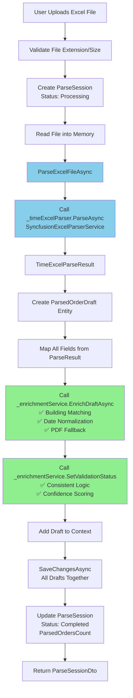
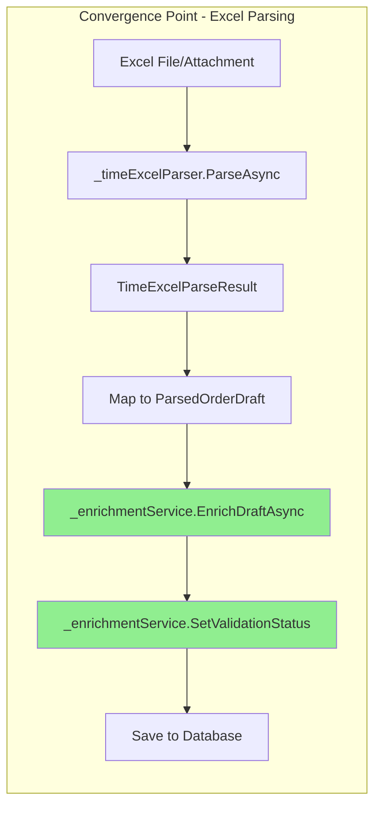
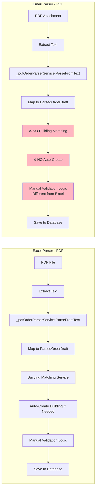
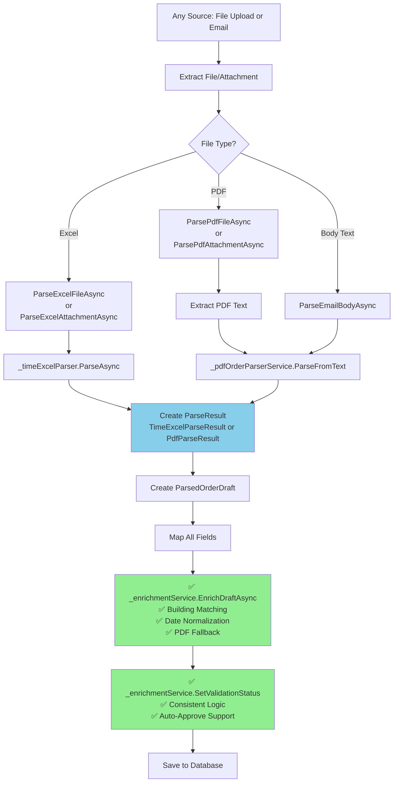

# Architecture Flow Comparison: Excel Parser vs Email Parser

## Side-by-Side Flow Diagrams

### Excel Parser Flow (Reference Implementation)

### Email Parser Flow (Under Review)

```mermaid
flowchart TD
    Start[Background Worker Polls IMAP] --> Connect[Connect to Email Account]
    Connect --> Fetch[Fetch New Emails]
    Fetch --> CheckDuplicate[Check if Email Already Processed]
    CheckDuplicate -->|Duplicate| Skip[Skip Email]
    CheckDuplicate -->|New| CreateEmailMsg[Create EmailMessage Entity]
    
    CreateEmailMsg --> ExtractAttachments[Extract Attachments from MIME]
    ExtractAttachments --> MatchTemplate[Match ParserTemplate]
    
    MatchTemplate --> CreateSession[Create ParseSession<br/>Status: Pending]
    CreateSession --> Route{Route by Template?}
    
    Route -->|Special Template| SpecialProcess[Process Special Email Types<br/>Reschedule, Withdrawal, RFB, etc.]
    Route -->|Standard| CheckAttachments{Has Attachments?}
    
    CheckAttachments -->|Excel| ParseExcel[ParseExcelAttachmentAsync]
    CheckAttachments -->|PDF| ParsePDF[ParsePdfAttachmentAsync]
    CheckAttachments -->|Body Only| ParseBody[Parse Email Body<br/>PdfOrderParserService]
    
    ParseExcel --> CallParser[Call _timeExcelParser.ParseAsync<br/>✅ Same as Excel Parser]
    CallParser --> ParseResult[TimeExcelParseResult]
    ParseResult --> CreateDraft[Create ParsedOrderDraft]
    CreateDraft --> MapFields[Map All Fields]
    MapFields --> Enrich[Call _enrichmentService.EnrichDraftAsync<br/>✅ Building Matching<br/>✅ Date Normalization]
    Enrich --> ValidateStatus[Call _enrichmentService.SetValidationStatus<br/>✅ Uses autoApprove Parameter]
    ValidateStatus --> SaveDraft[Add Draft to Context]
    
    ParsePDF --> ExtractText[Extract PDF Text]
    ExtractText --> CallPdfParser[Call _pdfOrderParserService.ParseFromText]
    CallPdfParser --> PdfResult[PdfOrderParseResult]
    PdfResult --> CreateDraft2[Create ParsedOrderDraft]
    CreateDraft2 --> MapFields2[Map All Fields]
    MapFields2 --> ManualValidate[Manual Validation Logic<br/>❌ NO Enrichment Service<br/>❌ NO Building Matching]
    ManualValidate --> SaveDraft2[Add Draft to Context]
    
    ParseBody --> CallPdfParser2[Call _pdfOrderParserService.ParseFromText]
    CallPdfParser2 --> BodyResult[PdfOrderParseResult]
    BodyResult --> CreateDraft3[Create ParsedOrderDraft]
    CreateDraft3 --> MapFields3[Map All Fields]
    MapFields3 --> ManualValidate2[Manual Validation Logic<br/>❌ NO Enrichment Service]
    ManualValidate2 --> SaveDraft3[Add Draft to Context]
    
    SaveDraft --> Save1[SaveChangesAsync<br/>After Attachments]
    SaveDraft2 --> Save1
    SaveDraft3 --> Save2[SaveChangesAsync<br/>After Body]
    
    Save1 --> AutoApprove{Template AutoApprove?}
    AutoApprove -->|Yes| ApproveDrafts[Auto-Approve Valid Drafts<br/>Call _parserService.ApproveParsedOrderAsync]
    AutoApprove -->|No| UpdateSession
    ApproveDrafts --> UpdateSession
    
    Save2 --> UpdateSession[Update ParseSession<br/>Status: Completed/Pending<br/>ParsedOrdersCount]
    
    UpdateSession --> End[Return Success]
    
    style Enrich fill:#90EE90
    style ValidateStatus fill:#90EE90
    style ManualValidate fill:#FFB6C1
    style ManualValidate2 fill:#FFB6C1
    style ParseExcel fill:#87CEEB
    style ParsePDF fill:#FFA500
    style ParseBody fill:#FFA500
```

## Convergence Point Analysis

### Where They Converge (Should Be Identical)

**✅ Status:** Excel parsing is **100% identical** between both parsers.

### Where They Diverge (Should Be Identical But Aren't)

**❌ Status:** PDF parsing is **NOT identical** - Email parser missing enrichment service.

## Detailed Component Comparison

### Entry Point Structure

| Component | Excel Parser | Email Parser | Status |
|-----------|--------------|-------------|--------|
| **Entry Method** | `CreateParseSessionFromFilesAsync` | `ProcessEmailAsync` | ✅ Different (Expected) |
| **Input Type** | `List<IFormFile>` | `MimeMessage` | ✅ Different (Expected) |
| **Session Creation** | Before parsing | Before parsing | ✅ Same Pattern |
| **Error Handling** | Try-catch with session update | Try-catch with session update | ✅ Same Pattern |

### Parsing Layer

| Component | Excel Parser | Email Parser | Status |
|-----------|--------------|-------------|--------|
| **Excel Parser Service** | `_timeExcelParser.ParseAsync` | `_timeExcelParser.ParseAsync` | ✅ Identical |
| **PDF Parser Service** | `_pdfOrderParserService.ParseFromText` | `_pdfOrderParserService.ParseFromText` | ✅ Identical |
| **PDF Text Extraction** | `_pdfTextExtractionService.ExtractTextAsync` | `_pdfTextExtractionService.ExtractTextAsync` | ✅ Identical |

### Enrichment Layer

| Component | Excel Parser | Email Parser | Status |
|-----------|--------------|-------------|--------|
| **Excel Enrichment** | `_enrichmentService.EnrichDraftAsync` | `_enrichmentService.EnrichDraftAsync` | ✅ Identical |
| **Excel Validation** | `_enrichmentService.SetValidationStatus` | `_enrichmentService.SetValidationStatus` | ✅ Identical |
| **PDF Enrichment** | `_enrichmentService.EnrichDraftAsync` | ❌ **MISSING** | ❌ Critical |
| **PDF Validation** | `_enrichmentService.SetValidationStatus` | ❌ Manual Logic | ❌ Critical |
| **Building Matching (Excel)** | Via enrichment service | Via enrichment service | ✅ Identical |
| **Building Matching (PDF)** | Via enrichment service | ❌ **MISSING** | ❌ Critical |

### Data Mapping

| Component | Excel Parser | Email Parser | Status |
|-----------|--------------|-------------|--------|
| **Field Mapping** | Identical field list | Identical field list | ✅ Same |
| **Materials Mapping** | JSON serialization | JSON serialization | ✅ Same |
| **Remarks Building** | PartnerCode + Remarks | PartnerCode + Remarks | ✅ Same |

### Database Operations

| Component | Excel Parser | Email Parser | Status |
|-----------|--------------|-------------|--------|
| **Transaction Boundary** | Batch save (all files) | Per-attachment save | ⚠️ Different |
| **Session Update** | After all files | After attachments + body | ⚠️ Different |
| **Error Recovery** | Placeholder drafts | Placeholder drafts | ✅ Same Pattern |

## Recommended Unified Architecture

**Key Principle:** After file/attachment extraction, **everything should be identical**.

---

## Summary

### ✅ What's Working (65%)
- Excel parsing is 100% identical
- Service dependencies are correct
- Error handling patterns match
- Data mapping is consistent

### ❌ What's Broken (25%)
- PDF parsing does NOT use enrichment service
- PDF parsing lacks building matching
- PDF validation logic is duplicated
- Different transaction batching

### ⚠️ What Needs Review (10%)
- Auto-approve parameter handling (intentional difference?)
- Transaction batching strategy (performance vs error isolation)

---

**Next Step:** Implement refactoring to make PDF parsing use enrichment service (see main audit document).

