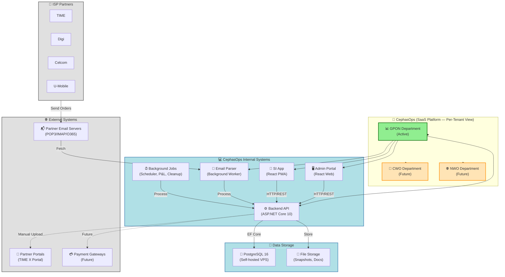

# Company & Systems Overview

**File:** `docs/architecture/00_company-systems-overview.md`  
**Purpose:** High-level view showing company structure, main systems, and external services

---

## Diagram: Company → Systems → External Services

---

## Key Relationships

### Company Structure
- **Multi-Tenant SaaS**: CephasOps operates as a SaaS platform with per-company data isolation and multiple departments per tenant
- **Departments**: Functional units (GPON active, CWO/NWO future)
- **Branches**: Physical locations for organizational structure

### Internal Systems
- **Admin Portal**: Web-based React app for operations teams
- **SI App**: Mobile-optimized PWA for field installers
- **Backend API**: ASP.NET Core 10 with Clean Architecture
- **Email Parser**: Background worker that processes partner emails
- **Background Jobs**: Async processing (scheduling, P&L calculations, cleanup)

### External Systems
- **Partner Email Servers**: Source of order emails (POP3/IMAP/O365)
- **Partner Portals**: TIME X Portal for invoice/docket submission (manual)
- **Payment Gateways**: Future integration for automated payments

### Data Storage
- **PostgreSQL 16**: Primary database (self-hosted on Debian 13 VPS)
- **File Storage**: Object storage for snapshots, documents, photos

---

**Related Diagrams:**
- [System Architecture](./10_system-architecture-flow.md) - Technical layer details
- [Email to Order Workflow](./20_workflow_email_to_order.md) - Email processing flow
- [Order Lifecycle](./21_workflow_order_lifecycle.md) - Complete order journey

