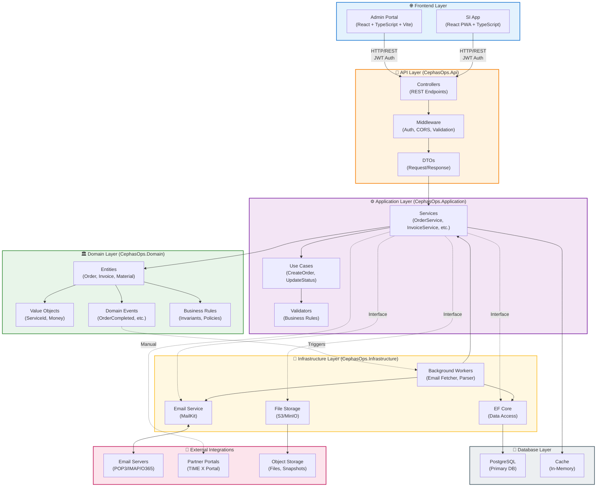
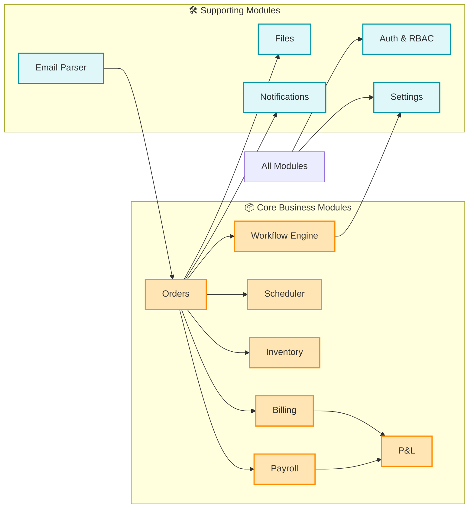
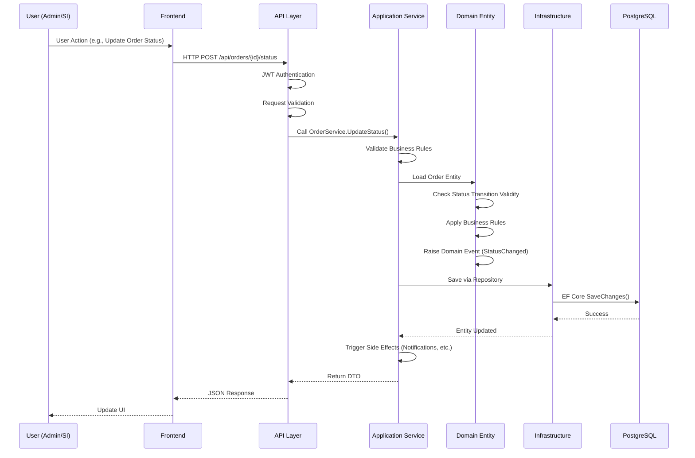

# System Architecture Flow

**File:** `docs/architecture/10_system-architecture-flow.md`  
**Purpose:** Technical architecture showing layers, components, and data flow

---

## Diagram: Clean Architecture Layers & Data Flow

---

## Module Dependencies Flow

---

## Request Flow: User Action → Database

---

## Architecture Principles

### Dependency Rule
- **Domain**: No dependencies (pure business logic)
- **Application**: Depends only on Domain
- **Infrastructure**: Depends only on Domain
- **API**: Depends on Application, Infrastructure, and Domain

### Clean Architecture Benefits
- **Testability**: Domain logic can be tested without infrastructure
- **Independence**: Can swap databases, frameworks, or UI technologies
- **Business Focus**: Core business logic isolated from technical details

---

**Related Diagrams:**
- [Company & Systems Overview](./00_company-systems-overview.md) - High-level system view
- [Email to Order Workflow](./20_workflow_email_to_order.md) - Email processing details
- [Order Lifecycle](./21_workflow_order_lifecycle.md) - Complete order journey

