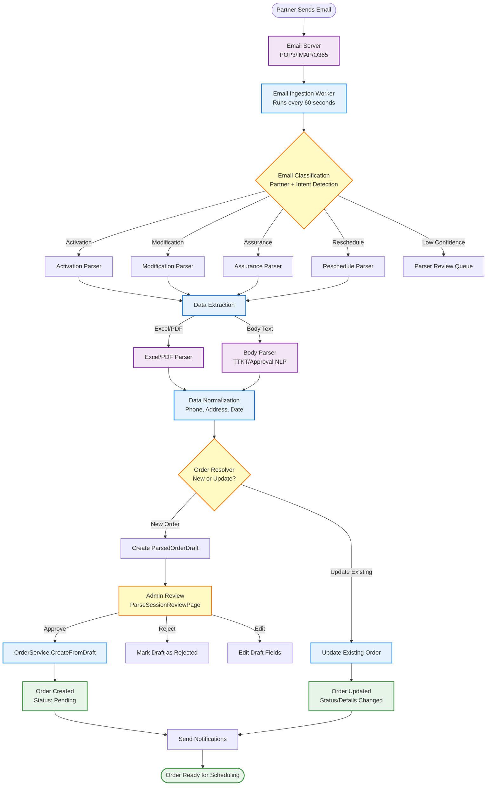
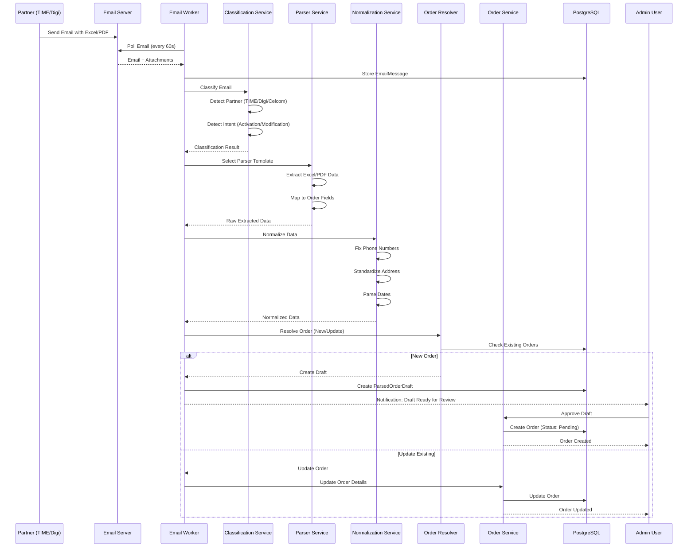
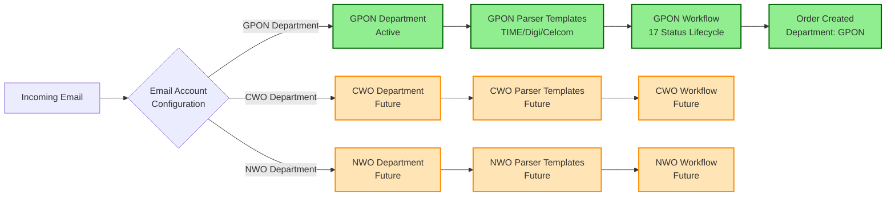

# Workflow: Email to Order Creation

**File:** `docs/architecture/20_workflow_email_to_order.md`  
**Purpose:** Complete flow from partner email to order creation in CephasOps

---

## Diagram: Email Pipeline Flow

---

## Sequence Diagram: Email Processing

---

## Department Routing Flow

---

## Key Components

### Email Ingestion
- **Frequency**: Every 60 seconds (configurable per mailbox)
- **Protocols**: IMAP, POP3, Microsoft Graph (O365)
- **Storage**: Raw email stored in `email_raw` table

### Classification
- **Partner Detection**: TIME, Digi, Celcom, U-Mobile
- **Intent Detection**: Activation, Modification, Assurance, Reschedule
- **Confidence Score**: < 0.75 → Review Queue

### Parsing
- **Excel Parser**: Handles TIME/Digi/Celcom formats
- **PDF Parser**: Converts PDF → Excel → Parse
- **Body Parser**: Extracts TTKT, approval text from email body
- **NLP**: Date/time extraction, approval detection

### Normalization
- **Phone**: `+60122334455` → `0122334455`
- **Address**: Extract unit/block/floor, standardize format
- **Date/Time**: Convert to `YYYY-MM-DD HH:mm`
- **Partner ID**: Map to internal Partner entity

### Order Resolution
- **Matching**: Service ID, Partner Order ID, Customer + Address
- **New Order**: Create ParsedOrderDraft → Admin Review → Create Order
- **Update**: Update existing order with new information

---

**Related Diagrams:**
- [Company & Systems Overview](./00_company-systems-overview.md) - System context
- [System Architecture](./10_system-architecture-flow.md) - Technical details
- [Order Lifecycle](./21_workflow_order_lifecycle.md) - After order creation

