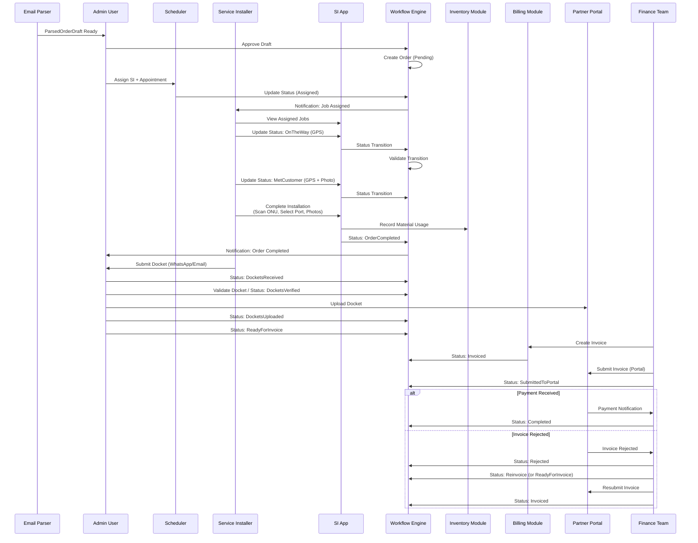
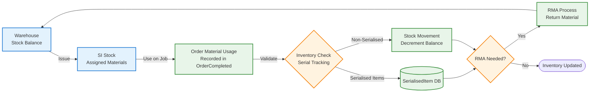
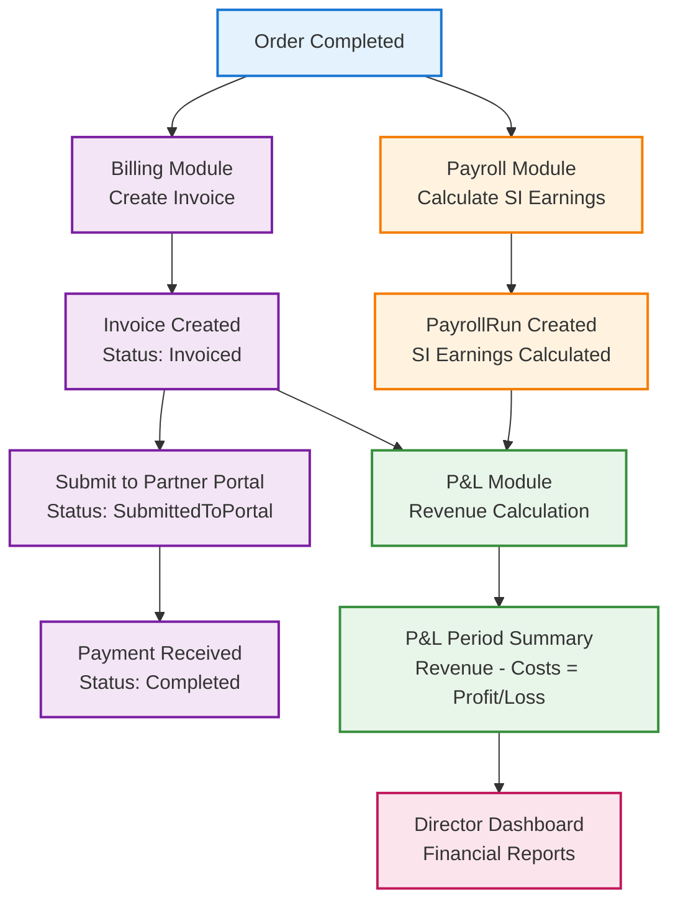

# Workflow: Order Lifecycle (Complete Journey)

**File:** `docs/architecture/21_workflow_order_lifecycle.md`  
**Purpose:** Complete order lifecycle from creation to payment, including all status transitions

> **Authority:** This document follows the [WORKFLOW_STATUS_REFERENCE.md](../05_data_model/WORKFLOW_STATUS_REFERENCE.md) (17 order statuses) and the seeded transitions in [07_gpon_order_workflow.sql](../backend/scripts/postgresql-seeds/07_gpon_order_workflow.sql). All statuses and transitions in the diagrams and lists below are valid per the reference and seed.  
> **InProgress:** Not a valid order status. It does not appear in the reference or in the seeded order workflow. The field flow is **Assigned → OnTheWay → MetCustomer → OrderCompleted** (no InProgress step).

---

## Diagram: Order Status Lifecycle (Main Flow)

```mermaid
flowchart TD
    Start([Order Created]) --> Pending[Pending<br/>Order awaiting assignment]
    
    Pending --> Assigned[Assigned<br/>SI assigned, appointment set]
    
    Assigned --> OnTheWay[OnTheWay<br/>SI en route, GPS captured]
    
    OnTheWay --> MetCustomer[MetCustomer<br/>SI met customer, GPS + photo]
    
    MetCustomer --> OrderCompleted[OrderCompleted<br/>Installation done, materials recorded]
    
    OrderCompleted --> DocketsReceived[DocketsReceived<br/>Admin received SI docket]
    
    DocketsReceived --> DocketsVerified[DocketsVerified<br/>Admin validated docket, QA passed]
    
    DocketsVerified --> DocketsUploaded[DocketsUploaded<br/>Admin uploaded to partner portal]
    
    DocketsUploaded --> ReadyForInvoice[ReadyForInvoice<br/>All data validated for billing]
    
    ReadyForInvoice --> Invoiced[Invoiced<br/>Invoice created, PDF generated]
    
    Invoiced --> SubmittedToPortal[SubmittedToPortal<br/>Submitted to partner portal]
    
    SubmittedToPortal --> Completed[Completed<br/>Payment received]
    
    SubmittedToPortal -->|Rejected| Rejected[Rejected<br/>Partner rejected invoice]
    Invoiced -->|Rejected| Rejected
    
    Rejected -->|Resubmit| ReadyForInvoice
    Rejected -->|Correct in portal| Reinvoice[Reinvoice<br/>Resubmit with new SubmissionId]
    
    Reinvoice --> Invoiced
    
    %% Side states (blockers)
    Assigned -->|Blocker| Blocker[Blocker<br/>Cannot proceed]
    OnTheWay -->|Blocker| Blocker
    MetCustomer -->|Blocker| Blocker
    
    Blocker -->|Resolved (queue)| Assigned
    Blocker -->|Resume at customer| MetCustomer
    Blocker -->|Reschedule| ReschedulePendingApproval[ReschedulePendingApproval<br/>Awaiting TIME approval]
    
    Assigned -->|Reschedule| ReschedulePendingApproval
    ReschedulePendingApproval -->|Approved| Assigned
    
    %% Terminal states
    Assigned -->|Cancel| Cancelled[Cancelled<br/>Terminal state]
    Blocker -->|Cancel| Cancelled
    ReschedulePendingApproval -->|Cancel| Cancelled
    Pending -->|Cancel| Cancelled
    
    %% Styling
    classDef mainFlow fill:#E3F2FD,stroke:#1976D2,stroke-width:2px
    classDef sideState fill:#FFF3E0,stroke:#F57C00,stroke-width:2px
    classDef terminal fill:#FCE4EC,stroke:#C2185B,stroke-width:2px
    classDef decision fill:#E8F5E9,stroke:#388E3C,stroke-width:2px
    
    class Pending,Assigned,OnTheWay,MetCustomer,OrderCompleted,DocketsReceived,DocketsVerified,DocketsUploaded,ReadyForInvoice,Invoiced,SubmittedToPortal,Completed mainFlow
    class Blocker,ReschedulePendingApproval,Rejected,Reinvoice sideState
    class Cancelled terminal
```

---

## Sequence Diagram: Complete Order Journey



---

## Material & Inventory Flow



---

## Financial Flow: Billing → Payroll → P&L



---

## Key Status Definitions

Statuses and transitions in this document align with [WORKFLOW_STATUS_REFERENCE.md](../05_data_model/WORKFLOW_STATUS_REFERENCE.md) and [07_gpon_order_workflow.sql](../backend/scripts/postgresql-seeds/07_gpon_order_workflow.sql).

- **Reference:** 17 order statuses (12 main flow + 5 side). No **InProgress** — the reference and seed use Assigned → OnTheWay → MetCustomer → OrderCompleted for fieldwork.
- **Seed:** Implements all 17 and adds the **docket rejection loop** (DocketsReceived ↔ DocketsRejected). DocketsRejected is in the seed and may exist in the Domain enum but is not one of the reference’s 17; the main diagram above omits it for simplicity; the business lifecycle doc covers it.

### Main Flow Statuses (12)
1. **Pending**: Order created, awaiting assignment
2. **Assigned**: SI assigned, appointment scheduled
3. **OnTheWay**: SI en route (GPS captured)
4. **MetCustomer**: SI met customer (GPS + photo)
5. **OrderCompleted**: Physical work completed, materials recorded
6. **DocketsReceived**: Admin received SI docket
7. **DocketsVerified**: Docket validated and QA passed
8. **DocketsUploaded**: Docket uploaded to partner portal
9. **ReadyForInvoice**: All data validated for billing
10. **Invoiced**: Invoice created and PDF generated
11. **SubmittedToPortal**: Invoice submitted to partner portal
12. **Completed**: Payment received, order closed

### Side States (5)
- **Blocker**: Job cannot proceed (can occur from Assigned, OnTheWay, MetCustomer). Exits: MetCustomer, Assigned, ReschedulePendingApproval, Cancelled (per reference and seed).
- **ReschedulePendingApproval**: Awaiting TIME approval for reschedule. Exits: Assigned, Cancelled.
- **Rejected**: Order/invoice rejected (code `Rejected`; UI may show “Invoice Rejected”). From Invoiced or SubmittedToPortal; can transition to ReadyForInvoice or Reinvoice.
- **Reinvoice**: Invoice to be resubmitted with new SubmissionId. Transitions to Invoiced.
- **Cancelled**: Order cancelled (terminal; from Pending, Assigned, Blocker, ReschedulePendingApproval).

---

## Workflow Engine Validation

Every status transition is validated by the Workflow Engine:
- **Guard Conditions**: Check if transition is allowed
- **Required Fields**: Ensure mandatory data is present
- **Business Rules**: Enforce domain invariants
- **Side Effects**: Trigger notifications, updates, calculations
- **Audit Trail**: Log all transitions with user, timestamp, reason

---

**Conformance:** Diagrams and status definitions match [WORKFLOW_STATUS_REFERENCE.md](../05_data_model/WORKFLOW_STATUS_REFERENCE.md) and [07_gpon_order_workflow.sql](../backend/scripts/postgresql-seeds/07_gpon_order_workflow.sql). The 17 order statuses are used; InProgress is not an order status (not in reference or seed).

---

**Related Diagrams:**
- [Company & Systems Overview](./00_company-systems-overview.md) - System context
- [Email to Order Workflow](./20_workflow_email_to_order.md) - Order creation
- [System Architecture](./10_system-architecture-flow.md) - Technical details

