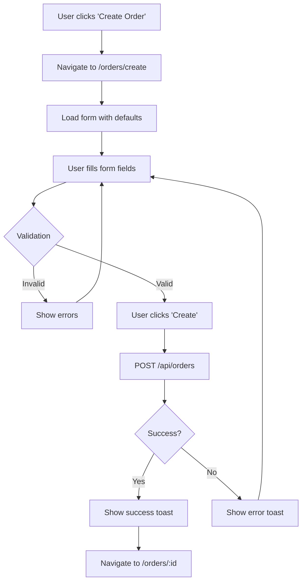
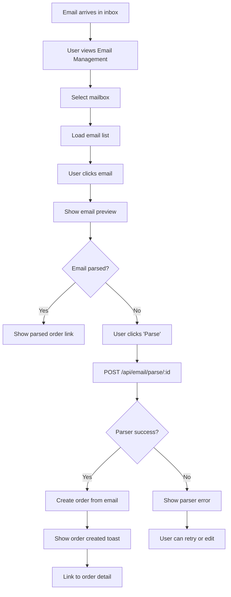
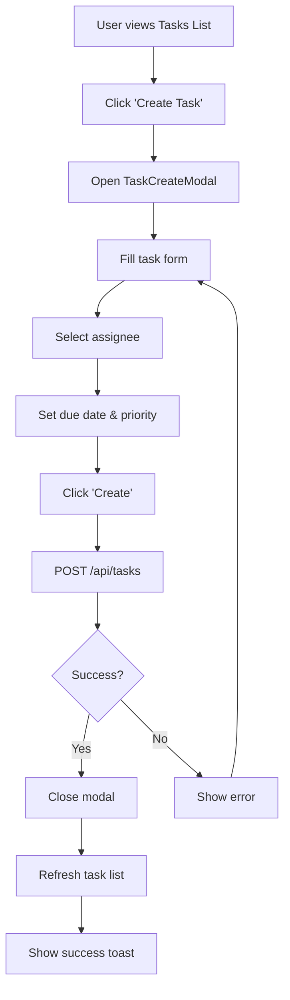
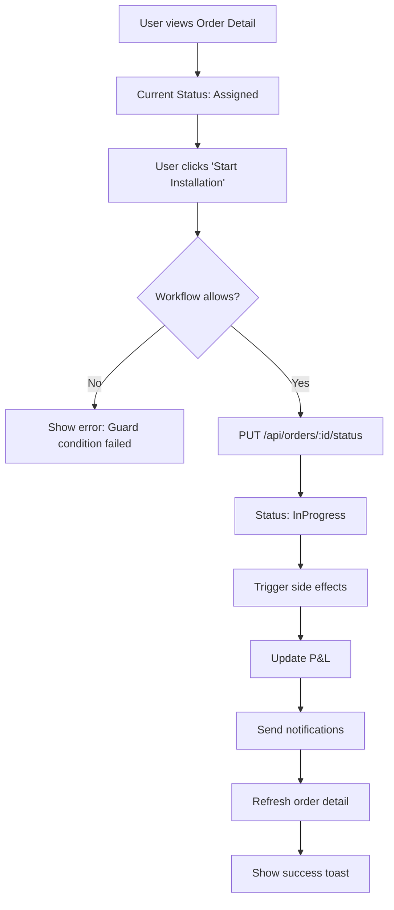
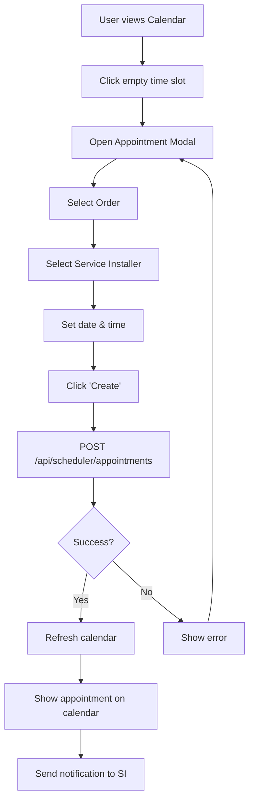

# 📚 CephasOps Frontend Storybook

**Complete UI Component Library & Screen Documentation**

---

## 📖 Table of Contents

1. [Introduction](#introduction)
2. [Component Library Overview](#component-library-overview)
3. [UI Patterns / Screens Completed](#ui-patterns--screens-completed)
4. [Interaction Flow Diagrams](#interaction-flow-diagrams)
5. [Styling Conventions](#styling-conventions)
6. [Folder Structure Explanation](#folder-structure-explanation)
7. [Future Extensions](#future-extensions)

---

## 1. Introduction

### What This Frontend Is

CephasOps Admin Portal is a comprehensive React-based web application for managing ISP/Solar operations, including:

- **Order Management** (GPON, NWO, CWO workflows)
- **Scheduling & Calendar** (Service Installer assignments)
- **Inventory & Assets** (Warehouses, materials, vehicles, tools)
- **Email Integration** (Inbox, parsing, templates)
- **Task Management** (Team tasks, assignments, workflows)
- **Finance** (Billing, P&L, Payroll, Accounting)
- **Settings & Configuration** (29+ settings pages)

### Tech Stack Summary

| Technology | Version | Purpose |
|------------|---------|---------|
| **React** | 18.2.0 | UI framework |
| **TypeScript** | 5.9.3 | Type safety |
| **Vite** | Latest | Build tool & dev server |
| **Tailwind CSS** | 4.0 | Utility-first styling |
| **shadcn/ui** | Latest | Component primitives |
| **Lucide React** | 0.344.0 | Icon library |
| **TanStack Query** | 5.90.11 | Data fetching & caching |
| **React Router** | 6.20.0 | Client-side routing |
| **React Hook Form** | 7.53.0 | Form management |
| **Zod** | 3.23.8 | Schema validation |
| **Syncfusion** | 31.x | Enterprise components (Grids, Charts, Scheduler, Kanban, Diagrams) |

### Architecture Summary

**Feature-Based Structure:**
- `/src/features` - Domain-specific feature modules (email, tasks, notifications)
- `/src/pages` - Route-level page components
- `/src/components` - Reusable UI components organized by domain
- `/src/api` - API client modules (one per domain)
- `/src/hooks` - Custom React hooks for data fetching
- `/src/contexts` - Global state management (Auth, Department, Theme, Notifications)

**UI Primitives:**
- All shadcn/ui components live in `/src/components/ui`
- Custom design tokens in `/src/lib/design-tokens.ts`
- macOS-inspired styling with compact mode support

**Service Layers:**
- Centralized API client (`/src/api/client.ts`) with automatic auth token injection
- Department context automatically injects `departmentId` into API calls
- TanStack Query for all data fetching with automatic caching and invalidation

---

## 2. Component Library Overview

### Core UI Primitives

All components are located in `/src/components/ui/` and exported via `/src/components/ui/index.ts`.

#### Button

**Path:** `frontend/src/components/ui/Button.tsx`

**Description:** Primary button component with multiple variants and sizes.

**Props:**
```typescript
interface ButtonProps {
  children: ReactNode;
  variant?: 'default' | 'destructive' | 'outline' | 'secondary' | 'ghost' | 'link';
  size?: 'default' | 'sm' | 'lg' | 'icon';
  className?: string;
  disabled?: boolean;
  onClick?: (e: React.MouseEvent<HTMLButtonElement>) => void;
  type?: 'button' | 'submit' | 'reset';
}
```

**Variants:**
- `default` - Primary action (blue background)
- `destructive` - Delete/danger actions (red background)
- `outline` - Secondary actions (bordered)
- `secondary` - Neutral actions (gray background)
- `ghost` - Minimal styling (hover only)
- `link` - Text link style

**Sizes:**
- `sm` - Height 32px, compact padding
- `default` - Height 36px, standard padding
- `lg` - Height 40px, larger padding
- `icon` - Square 32px, icon-only

**Usage:**
```tsx
<Button variant="default" size="sm" onClick={handleClick}>
  Save Changes
</Button>
```

**Where Used:** Every page for actions, forms, modals, navigation.

---

#### Card

**Path:** `frontend/src/components/ui/Card.tsx`

**Description:** Container component for grouping related content with optional header/footer.

**Props:**
```typescript
interface CardProps {
  children: ReactNode;
  title?: string;
  subtitle?: string;
  header?: ReactNode;
  footer?: ReactNode;
  onClick?: () => void;
  className?: string;
  hoverable?: boolean;
  variant?: 'default' | 'bordered' | 'elevated' | 'frosted' | 'outlined';
  compact?: boolean;
}
```

**Variants:**
- `default` - Standard card with border
- `bordered` - Thicker border (2px)
- `elevated` - Enhanced shadow
- `frosted` - Frosted glass effect (backdrop blur)
- `outlined` - Border only, no background

**Features:**
- `compact` mode reduces padding (p-3 vs p-6)
- `hoverable` adds hover lift effect
- `onClick` makes entire card clickable

**Usage:**
```tsx
<Card 
  title="Order Details" 
  subtitle="GPON Installation"
  variant="elevated"
  compact
>
  <p>Content here</p>
</Card>
```

**Where Used:** Dashboard stat cards, detail pages, settings sections, list items.

---

#### DataTable

**Path:** `frontend/src/components/ui/DataTable.tsx`

**Description:** Flexible data table with sorting, pagination, and custom cell rendering.

**Props:**
```typescript
interface DataTableProps<T> {
  columns?: DataTableColumn<T>[];
  data?: T[];
  loading?: boolean;
  pagination?: boolean;
  pageSize?: number;
  sortable?: boolean;
  onSort?: (config: SortConfig) => void;
  onRowClick?: (row: T, rowIndex: number) => void;
  emptyMessage?: string;
  className?: string;
}

interface DataTableColumn<T> {
  key: string;
  label: string;
  sortable?: boolean;
  width?: string | number;
  render?: (value: unknown, row: T, rowIndex: number) => ReactNode;
  sortValue?: (row: T) => any;
}
```

**Features:**
- Client-side or server-side sorting
- Pagination with page size control
- Custom cell rendering via `render` prop
- Row click handlers
- Loading and empty states

**Usage:**
```tsx
<DataTable
  columns={[
    { key: 'id', label: 'ID', sortable: true },
    { key: 'name', label: 'Name', sortable: true },
    { 
      key: 'status', 
      label: 'Status',
      render: (value, row) => <StatusBadge status={row.status} />
    }
  ]}
  data={orders}
  loading={isLoading}
  onRowClick={(row) => navigate(`/orders/${row.id}`)}
  pagination
  pageSize={20}
/>
```

**Where Used:** Orders list, Inventory list, Tasks list, Settings tables, Email inbox.

---

#### Modal

**Path:** `frontend/src/components/ui/Modal.tsx`

**Description:** Overlay dialog for focused interactions.

**Props:**
```typescript
interface ModalProps {
  isOpen: boolean;
  onClose?: () => void;
  title?: string;
  children: ReactNode;
  size?: 'small' | 'medium' | 'large' | 'xl';
  closeOnOverlayClick?: boolean;
  closeOnEscape?: boolean;
  className?: string;
}
```

**Sizes:**
- `small` - Max width 400px
- `medium` - Max width 600px (default)
- `large` - Max width 800px
- `xl` - Max width 1200px

**Features:**
- ESC key closes modal
- Click outside closes (configurable)
- Body scroll lock when open
- Frosted glass backdrop

**Usage:**
```tsx
<Modal
  isOpen={showModal}
  onClose={() => setShowModal(false)}
  title="Create Order"
  size="large"
>
  <OrderForm onSubmit={handleSubmit} />
</Modal>
```

**Where Used:** Forms, confirmations, detail views, wizards.

---

#### StatusBadge

**Path:** `frontend/src/components/ui/StatusBadge.tsx`

**Description:** Colored badge for displaying status indicators.

**Props:**
```typescript
interface StatusBadgeProps {
  status?: string;
  variant?: 'default' | 'success' | 'error' | 'warning' | 'info' | 'secondary';
  size?: 'sm' | 'default' | 'lg';
  className?: string;
  children?: ReactNode;
}
```

**Variants:**
- `success` - Green (completed, active)
- `error` - Red (failed, blocked)
- `warning` - Yellow (pending, on-hold)
- `info` - Blue (in-progress, assigned)
- `default` - Gray (neutral)
- `secondary` - Light gray

**Usage:**
```tsx
<StatusBadge variant="success" size="sm">
  Completed
</StatusBadge>
```

**Where Used:** Order status, task status, email parser status, inventory status.

---

#### Input / TextInput

**Path:** `frontend/src/components/ui/input.tsx` (shadcn)  
**Path:** `frontend/src/components/ui/TextInput.tsx` (custom wrapper)

**Description:** Text input with label, error state, and validation support.

**Props (TextInput):**
```typescript
interface TextInputProps {
  label?: string;
  name?: string;
  value?: string;
  onChange?: (e: React.ChangeEvent<HTMLInputElement>) => void;
  placeholder?: string;
  error?: string;
  required?: boolean;
  disabled?: boolean;
  type?: string;
  className?: string;
}
```

**Features:**
- Automatic label association
- Error message display
- Required field indicator
- Compact mode support (h-8 vs h-9)

**Usage:**
```tsx
<TextInput
  label="Order Number"
  name="orderNumber"
  value={formData.orderNumber}
  onChange={handleChange}
  error={errors.orderNumber}
  required
/>
```

**Where Used:** All forms, filters, search inputs.

---

#### Select

**Path:** `frontend/src/components/ui/Select.tsx`

**Description:** Dropdown select with label and error handling.

**Props:**
```typescript
interface SelectProps {
  label?: string;
  name?: string;
  value?: string;
  onChange?: (e: React.ChangeEvent<HTMLSelectElement>) => void;
  options?: SelectOptionValue[];
  placeholder?: string;
  error?: string;
  required?: boolean;
  disabled?: boolean;
  className?: string;
}

interface SelectOption {
  value: string;
  label: string;
  disabled?: boolean;
}
```

**Usage:**
```tsx
<Select
  label="Department"
  name="departmentId"
  value={selectedDept}
  onChange={handleChange}
  options={[
    { value: '1', label: 'GPON' },
    { value: '2', label: 'NWO' }
  ]}
  required
/>
```

**Where Used:** Filters, forms, settings, department/partner selectors.

---

#### DatePicker / DateTimePicker

**Path:** `frontend/src/components/ui/DatePicker.tsx`  
**Path:** `frontend/src/components/ui/DateTimePicker.tsx`

**Description:** Date and datetime selection components.

**Props:**
```typescript
interface DatePickerProps {
  label?: string;
  value?: Date | string;
  onChange?: (date: Date | null) => void;
  minDate?: Date;
  maxDate?: Date;
  disabled?: boolean;
  required?: boolean;
  error?: string;
}
```

**Usage:**
```tsx
<DatePicker
  label="Appointment Date"
  value={appointmentDate}
  onChange={setAppointmentDate}
  minDate={new Date()}
  required
/>
```

**Where Used:** Order creation, scheduler, filters, appointment booking.

---

#### LoadingSpinner

**Path:** `frontend/src/components/ui/LoadingSpinner.tsx`

**Description:** Centered loading indicator.

**Props:**
```typescript
interface LoadingSpinnerProps {
  size?: 'sm' | 'md' | 'lg';
  className?: string;
  text?: string;
}
```

**Usage:**
```tsx
{loading ? (
  <LoadingSpinner text="Loading orders..." />
) : (
  <DataTable data={orders} />
)}
```

**Where Used:** All async data loading states.

---

#### EmptyState

**Path:** `frontend/src/components/ui/EmptyState.tsx`

**Description:** Empty state display when no data is available.

**Props:**
```typescript
interface EmptyStateProps {
  title?: string;
  message?: string;
  icon?: LucideIcon;
  action?: ReactNode;
}
```

**Usage:**
```tsx
{orders.length === 0 ? (
  <EmptyState
    title="No Orders Found"
    message="Create your first order to get started"
    icon={ClipboardList}
    action={<Button onClick={handleCreate}>Create Order</Button>}
  />
) : (
  <DataTable data={orders} />
)}
```

**Where Used:** Empty lists, search results, filtered views.

---

#### Toast / useToast

**Path:** `frontend/src/components/ui/Toast.tsx`

**Description:** Toast notification system for success/error messages.

**Usage:**
```tsx
const { showSuccess, showError, showInfo } = useToast();

// In component
showSuccess('Order created successfully');
showError('Failed to save order');
```

**Where Used:** All mutations, form submissions, API errors.

---

#### ConfirmDialog

**Path:** `frontend/src/components/ui/ConfirmDialog.tsx`

**Description:** Confirmation dialog for destructive actions.

**Props:**
```typescript
interface ConfirmDialogProps {
  isOpen: boolean;
  onClose: () => void;
  onConfirm: () => void;
  title: string;
  message: string;
  confirmLabel?: string;
  cancelLabel?: string;
  variant?: 'default' | 'destructive';
}
```

**Usage:**
```tsx
<ConfirmDialog
  isOpen={showDelete}
  onClose={() => setShowDelete(false)}
  onConfirm={handleDelete}
  title="Delete Order"
  message="Are you sure you want to delete this order? This action cannot be undone."
  variant="destructive"
/>
```

**Where Used:** Delete actions, cancel operations, destructive workflows.

---

#### Breadcrumbs

**Path:** `frontend/src/components/ui/Breadcrumbs.tsx`

**Description:** Navigation breadcrumb trail.

**Props:**
```typescript
interface Breadcrumb {
  label: string;
  path?: string;
}
```

**Usage:**
```tsx
<Breadcrumbs
  items={[
    { label: 'Orders', path: '/orders' },
    { label: 'Order #12345' }
  ]}
/>
```

**Where Used:** Detail pages, nested navigation.

---

#### Tabs

**Path:** `frontend/src/components/ui/Tabs.tsx`

**Description:** Tabbed interface for organizing content.

**Props:**
```typescript
interface TabsProps {
  defaultValue?: string;
  value?: string;
  onValueChange?: (value: string) => void;
  children: ReactNode;
}

interface TabPanelProps {
  value: string;
  children: ReactNode;
}
```

**Usage:**
```tsx
<Tabs defaultValue="details">
  <TabPanel value="details">Order Details</TabPanel>
  <TabPanel value="history">Order History</TabPanel>
  <TabPanel value="materials">Materials</TabPanel>
</Tabs>
```

**Where Used:** Order detail pages, settings pages, multi-section views.

---

#### PageShell

**Path:** `frontend/src/components/layout/PageShell.tsx`

**Description:** Standard page wrapper with title, breadcrumbs, and action buttons.

**Props:**
```typescript
interface PageShellProps {
  title?: string;
  breadcrumbs?: Breadcrumb[];
  actions?: ReactNode;
  children: ReactNode;
  className?: string;
  compact?: boolean;
}
```

**Usage:**
```tsx
<PageShell
  title="Orders"
  breadcrumbs={[{ label: 'Orders' }]}
  actions={
    <Button onClick={handleCreate}>
      <Plus className="h-4 w-4" />
      Create Order
    </Button>
  }
>
  <OrdersList />
</PageShell>
```

**Where Used:** Every page for consistent layout structure.

---

### Layout Components

#### MainLayout

**Path:** `frontend/src/components/layout/MainLayout.tsx`

**Description:** Main app shell with sidebar, top nav, and content area.

**Features:**
- Fixed top navigation (frosted glass)
- Collapsible sidebar (desktop) / drawer (mobile)
- Responsive breakpoints
- Auto-closing mobile menu

**Structure:**
```
MainLayout
├── TopNav (fixed top)
├── Sidebar (collapsible)
└── Main Content (scrollable)
```

---

#### Sidebar

**Path:** `frontend/src/components/layout/Sidebar.tsx`

**Description:** Navigation sidebar with sections, expandable menus, and permission-based visibility.

**Features:**
- Section-based organization (Main, Operations, Resources, Finance, Tools, System)
- Expandable sub-menus
- Settings mega-menu with grouped items
- Permission-based item visibility
- Active route highlighting
- Mobile drawer mode

**Navigation Sections:**
- **Main:** Dashboard
- **Operations:** Orders, Scheduler, Tasks
- **Resources:** Assets, Inventory, Buildings, Splitter Master
- **Finance:** Billing, Payroll, P&L, Accounting
- **Tools:** Email, Documents, Files, Workflow
- **System:** Notifications, Settings

---

#### TopNav

**Path:** `frontend/src/components/layout/TopNav.tsx`

**Description:** Fixed top navigation bar with user menu, notifications, and department selector.

**Features:**
- User profile dropdown
- Notification bell with unread count
- Department selector (if multi-department)
- Mobile menu toggle
- Frosted glass effect

---

### Feature-Specific Components

#### Order Components

**Path:** `frontend/src/components/orders/`

- `OrderFilters.tsx` - Advanced filtering UI
- `OrderStatusBadge.tsx` - Order status display
- `OrderCard.tsx` - Order list item card
- `OrderTimeline.tsx` - Status history timeline

---

#### Task Components

**Path:** `frontend/src/features/tasks/components/`

- `TaskCard.tsx` - Task display card
- `TaskCreateModal.tsx` - Task creation form
- `TaskDetailsModal.tsx` - Task detail view
- `TaskStatusBadge.tsx` - Task status indicator
- `TaskPriorityBadge.tsx` - Priority indicator
- `TaskStatusFilter.tsx` - Status filter dropdown

---

#### Email Components

**Path:** `frontend/src/features/email/`

- `EmailMailboxesPage.tsx` - Email account management
- `EmailRulesPage.tsx` - Email parsing rules
- `ParserTemplatesPage.tsx` - Parser template configuration
- `VipEmailsPage.tsx` - VIP email management

---

#### Scheduler Components

**Path:** `frontend/src/components/scheduler/`

- Calendar views (day/week/month)
- Timeline view
- Appointment cards
- Drag-and-drop support
- Service Installer availability

---

#### Chart Components

**Path:** `frontend/src/components/charts/`

- `OrdersTrendChart.tsx` - Order volume trends
- `OrdersByPartnerChart.tsx` - Partner distribution
- `RevenueChart.tsx` - Revenue visualization
- `StatusDistributionChart.tsx` - Status breakdown

---

#### Syncfusion Components

**Path:** `frontend/src/components/syncfusion/`

- Enhanced DataGrid (with filtering, sorting, grouping)
- Scheduler (calendar with appointments)
- Kanban (task boards)
- TreeGrid (hierarchical data)
- Diagram (visual layouts - warehouse, splitter topology)
- Charts (advanced visualizations)

**Usage:**
```tsx
import { SfDataGrid } from '../components/syncfusion';

<SfDataGrid
  dataSource={orders}
  allowFiltering
  allowSorting
  allowGrouping
  pageSettings={{ pageSize: 20 }}
/>
```

---

## 3. UI Patterns / Screens Completed

### Authentication

#### Login Page

**Path:** `frontend/src/pages/auth/LoginPage.tsx`

**Purpose:** User authentication with email/password.

**Components Used:**
- `TextInput` for email/password
- `Button` for submit
- `Card` for form container
- `LoadingSpinner` during authentication

**State Flow:**
1. User enters credentials
2. Form validation (Zod schema)
3. API call to `/api/auth/login`
4. Token stored in localStorage
5. User data fetched from `/api/auth/me`
6. Redirect to dashboard

**Data Flow:**
- `POST /api/auth/login` → Returns token
- `GET /api/auth/me` → Returns user object

---

### Dashboard

**Path:** `frontend/src/pages/DashboardPage.tsx`

**Purpose:** Operations overview with KPIs, charts, and quick actions.

**Components Used:**
- `Card` for stat cards
- `OrdersTrendChart`, `OrdersByPartnerChart` for visualizations
- `StatusBadge` for status indicators
- `Button` for quick actions

**Sections:**
1. **Stat Cards:** Total orders, pending, in-progress, completed
2. **Trend Charts:** Order volume over time, partner distribution
3. **Recent Orders:** Latest order list with status
4. **Quick Actions:** Create order, view scheduler, check tasks

**Data Flow:**
- `GET /api/orders?status=...` for filtered counts
- `GET /api/orders?limit=10&sortBy=createdAt&sortOrder=desc` for recent orders
- Chart data aggregated from orders API

---

### Orders Management

#### Orders List Page

**Path:** `frontend/src/pages/orders/OrdersListPage.tsx`  
**Enhanced:** `frontend/src/pages/orders/OrdersListPageEnhanced.tsx` (Syncfusion Grid)

**Purpose:** View, filter, and manage all orders.

**Components Used:**
- `DataTable` / `SfDataGrid` for order list
- `OrderFilters` for advanced filtering
- `StatusBadge` for status display
- `Button` for actions (create, export, import)
- `Modal` for import options
- `PageShell` for layout

**Features:**
- Multi-column filtering (status, partner, date range, SI, building)
- Sorting by any column
- Pagination (20 per page)
- Export to Excel
- Import from email or file upload
- Row click → navigate to detail
- Bulk actions (status update, assign SI)

**Data Flow:**
- `GET /api/orders?departmentId=...&status=...&partnerId=...` with filters
- `PUT /api/orders/:id` for status updates
- `POST /api/orders/import` for file uploads

**State Flow:**
1. Load orders with current filters
2. User applies filters → refetch
3. User clicks row → navigate to detail
4. User clicks action → open modal or update status

---

#### Order Detail Page

**Path:** `frontend/src/pages/orders/OrderDetailPage.tsx`

**Purpose:** View and edit individual order details.

**Components Used:**
- `Card` for sections (customer, address, appointment, materials)
- `Tabs` for organizing content (details, history, materials, photos)
- `StatusBadge` for status
- `Button` for actions (edit, cancel, reschedule)
- `Breadcrumbs` for navigation

**Sections:**
1. **Order Header:** ID, status, priority, partner
2. **Customer Info:** Name, phone, email
3. **Address:** Full address with map link
4. **Appointment:** Date, time window, SI assignment
5. **Materials:** Required materials list
6. **History:** Status timeline, audit log
7. **Photos:** Uploaded photos from SI

**Data Flow:**
- `GET /api/orders/:orderId` for order data
- `PUT /api/orders/:orderId` for updates
- `GET /api/orders/:orderId/history` for timeline

---

#### Create Order Page

**Path:** `frontend/src/pages/orders/CreateOrderPage.tsx`

**Purpose:** Create new orders (Activation/Modification).

**Components Used:**
- `TextInput` for form fields
- `Select` for dropdowns (partner, order type, SI)
- `DatePicker` for appointment date
- `DateTimePicker` for time windows
- `Button` for submit/cancel
- `Card` for form sections

**Form Fields:**
- TBBN, Service ID, Order Type, Product Type
- Customer (name, phone, email)
- Address (full address fields)
- Building selection
- Appointment (date, time window)
- Materials (template or manual)

**Validation:**
- Required fields (TBBN, customer name, address)
- Date validation (appointment must be future)
- Phone/email format validation

**Data Flow:**
- `POST /api/orders` with order data
- `GET /api/partners` for partner list
- `GET /api/service-installers` for SI list
- `GET /api/buildings` for building search

---

### Email Management

#### Email Management Page

**Path:** `frontend/src/pages/email/EmailManagementPage.tsx`

**Purpose:** Email inbox, parsing, and template management.

**Components Used:**
- `Card` for mailbox list and email list
- `DataTable` for email list
- `StatusBadge` for parser status
- `Modal` for email preview and compose
- `Button` for actions (send, reply, forward, delete)

**Features:**
- **Mailbox Selection:** Switch between email accounts
- **Folder Navigation:** Inbox, Sent, Archive
- **Email List:** Subject, from, date, parser status
- **Email Preview:** Full email body with attachments
- **Compose:** Send email with template support
- **Parser Status:** Shows if email was parsed into order

**Data Flow:**
- `GET /api/email/accounts` for mailboxes
- `GET /api/email/messages?mailboxId=...` for emails
- `GET /api/email/messages/:id` for email detail
- `POST /api/email/send` for sending
- `POST /api/email/parse/:id` for manual parsing

**State Flow:**
1. Select mailbox → load emails
2. Click email → show preview
3. Click parse → trigger parser → show result
4. Compose email → select template → send

---

### Scheduler

#### Calendar Page

**Path:** `frontend/src/pages/scheduler/CalendarPage.tsx`  
**Enhanced:** `frontend/src/pages/scheduler/CalendarPageEnhanced.tsx` (Syncfusion Scheduler)

**Purpose:** Visual calendar view of appointments and SI assignments.

**Components Used:**
- `SfScheduler` (Syncfusion) for calendar
- `Card` for appointment details
- `StatusBadge` for appointment status
- `Button` for actions (create, edit, reschedule)

**Views:**
- **Day View:** Hourly timeline
- **Week View:** 7-day grid
- **Month View:** Calendar grid
- **Timeline View:** Gantt-style timeline

**Features:**
- Drag-and-drop to reschedule
- Color coding by order type
- SI resource grouping
- Appointment popup on click
- Filter by SI, status, order type

**Data Flow:**
- `GET /api/scheduler/appointments?fromDate=...&toDate=...` for calendar data
- `PUT /api/scheduler/appointments/:id` for rescheduling
- `POST /api/scheduler/appointments` for creating

---

### Tasks

#### Tasks List Page

**Path:** `frontend/src/pages/tasks/TasksListPage.tsx`

**Purpose:** View and manage team tasks.

**Components Used:**
- `DataTable` for task list
- `TaskStatusBadge`, `TaskPriorityBadge` for indicators
- `TaskCreateModal` for creation
- `TaskDetailsModal` for details
- `Button` for actions

**Features:**
- Filter by status, priority, assignee
- Sort by due date, priority, status
- Create task modal
- Task detail modal
- Status updates
- Bulk actions

**Data Flow:**
- `GET /api/tasks?departmentId=...&status=...` for filtered tasks
- `POST /api/tasks` for creation
- `PUT /api/tasks/:id` for updates

---

#### Tasks Kanban Page

**Path:** `frontend/src/pages/tasks/TasksKanbanPage.tsx`

**Purpose:** Kanban board view of tasks.

**Components Used:**
- `SfKanban` (Syncfusion) for board
- `TaskCard` for task items
- Drag-and-drop between columns

**Columns:**
- To Do
- In Progress
- Review
- Done

**Data Flow:**
- `GET /api/tasks?departmentId=...` for all tasks
- `PUT /api/tasks/:id` when dragging (status update)

---

### Inventory

#### Inventory Dashboard

**Path:** `frontend/src/pages/inventory/InventoryDashboardPage.tsx`

**Purpose:** Inventory overview with stock levels and alerts.

**Components Used:**
- `Card` for stat cards
- `DataTable` for low stock items
- `StatusBadge` for stock status
- Charts for stock trends

**Sections:**
1. **Stock Summary:** Total items, low stock count, out of stock
2. **Low Stock Alerts:** Items below threshold
3. **Recent Movements:** In/out transactions
4. **Warehouse Summary:** Stock by warehouse

**Data Flow:**
- `GET /api/inventory/summary` for dashboard data
- `GET /api/inventory/items?lowStock=true` for alerts

---

#### Inventory List Page

**Path:** `frontend/src/pages/inventory/InventoryListPage.tsx`  
**Enhanced:** `frontend/src/pages/inventory/InventoryListPageEnhanced.tsx` (Syncfusion Grid)

**Purpose:** Full inventory list with filtering and management.

**Components Used:**
- `SfDataGrid` for inventory table
- Filters for warehouse, category, brand, stock status
- `Button` for actions (adjust stock, transfer, RMA)

**Features:**
- Multi-column filtering
- Grouping by warehouse/category
- Export to Excel
- Stock adjustment modal
- Transfer between warehouses
- Serial number tracking

**Data Flow:**
- `GET /api/inventory/items?warehouseId=...&categoryId=...` with filters
- `PUT /api/inventory/items/:id` for stock adjustments

---

#### Warehouse Layout Page

**Path:** `frontend/src/pages/inventory/WarehouseLayoutPage.tsx`

**Purpose:** Visual warehouse layout with bin locations (🔥 Unique Feature).

**Components Used:**
- `SfDiagram` (Syncfusion) for visual layout
- Interactive bin nodes
- Color coding by capacity

**Features:**
- Visual bin locations (Section A, B, C)
- Capacity color coding (Green >70%, Yellow 30-70%, Red <30%)
- Click bin to see contents
- Search & highlight material location
- Pick route optimizer

**Data Flow:**
- `GET /api/inventory/warehouses/:id/layout` for layout data
- `GET /api/inventory/bins/:id/contents` for bin contents

---

### Settings

**Path:** `frontend/src/pages/settings/`

29+ settings pages organized by category:

**Company Settings:**
- Company Profile
- Departments
- Partners
- Partner Groups
- Business Hours

**Finance Settings:**
- P&L Types
- Asset Types

**Workflow Settings:**
- Order Statuses
- Workflow Definitions
- Guard Conditions
- Side Effects
- SLA Configuration
- Automation Rules
- Approval Workflows
- Time Slots
- Escalation Rules

**GPON Master Data:**
- Service Installers
- Rate Engine
- Order Types
- Installation Types
- Installation Methods
- Splitter Types

**Templates:**
- Document Templates
- Email Templates
- SMS Templates
- WhatsApp Templates

**System:**
- Email Setup
- KPI Profiles
- Report Definitions
- System Settings
- Integrations

**All settings pages use:**
- `PageShell` for layout
- `Card` for sections
- `TextInput`, `Select`, `DatePicker` for forms
- `DataTable` / `SfDataGrid` for lists
- `Button` for save/cancel
- `useToast` for feedback

---

## 4. Interaction Flow Diagrams

### Order Creation Flow



---

### Email Parsing Flow



---

### Task Assignment Flow



---

### Order Status Transition Flow



---

### Scheduler Appointment Creation Flow



---

## 5. Styling Conventions

### Compact Mode / Low Padding

The frontend uses **iPhone-like density** with compact spacing:

**Design Tokens** (`/src/lib/design-tokens.ts`):
- **Tight spacing:** `gap-1` (4px)
- **Compact spacing:** `gap-2` (8px) - Default for forms, grids
- **Standard spacing:** `gap-3` (12px)
- **Relaxed spacing:** `gap-4` (16px) - Rarely used

**Padding:**
- **Tight:** `p-2` (8px)
- **Compact:** `p-3` (12px) - Default for cards, sections
- **Standard:** `p-4` (16px)

**Input Heights:**
- **Compact:** `h-8` (32px) - Default
- **Standard:** `h-9` (36px)
- **Large:** `h-10` (40px) - Rarely used

**Card Compact Mode:**
```tsx
<Card compact>  // Uses p-3 instead of p-6
  Content
</Card>
```

---

### Tailwind Class Patterns

**Spacing:**
- Use `gap-2` for flex/grid containers (compact)
- Use `p-3` for card padding (compact)
- Use `mb-2` or `mb-3` for vertical spacing between elements

**Typography:**
- **Page Title:** `text-base font-semibold` (16px)
- **Section Header:** `text-sm font-semibold` (14px)
- **Field Label:** `text-xs font-medium uppercase tracking-wide` (12px)
- **Body:** `text-sm` (14px)
- **Data:** `text-xs` (12px)
- **Helper:** `text-[10px]` (10px)

**Colors:**
- Use CSS variables: `bg-card`, `text-foreground`, `border-border`
- Status colors: `bg-green-100 text-green-800` (success), `bg-red-100 text-red-800` (error)

**Borders:**
- Standard: `border border-border`
- Rounded: `rounded-lg` (8px) - Default
- Smaller: `rounded-md` (6px)

**Shadows:**
- Cards: `shadow-sm`
- Hover: `shadow-md`
- Modals: `shadow-lg`

---

### shadcn/ui Component Overrides

All shadcn components are customized with:

1. **Compact sizing** (h-8 instead of h-10)
2. **macOS-inspired colors** (from design tokens)
3. **Frosted glass effects** where appropriate
4. **Consistent spacing** (gap-2, p-3)

**Custom Classes:**
- `.frosted-glass` - Backdrop blur with semi-transparent background
- `.hover-lift` - Subtle lift on hover
- `.transition-smooth` - 200ms cubic-bezier transition
- `.focus-ring` - macOS-style focus ring

---

### Icon Usage (Lucide)

**Import Pattern:**
```tsx
import { Plus, Edit, Trash2, Mail } from 'lucide-react';
```

**Sizing:**
- **Small:** `h-3 w-3` (12px) - Inline with text
- **Default:** `h-4 w-4` (16px) - Buttons, lists
- **Medium:** `h-5 w-5` (20px) - Headers
- **Large:** `h-6 w-6` (24px) - Feature icons

**Usage:**
```tsx
<Button>
  <Plus className="h-4 w-4" />
  Create Order
</Button>
```

---

### Color Scheme Tokens

**Light Mode** (default):
- Background: `hsl(0 0% 100%)` - White
- Foreground: `hsl(222.2 47% 11%)` - Dark gray
- Primary: `hsl(221.2 83.2% 53.3%)` - Blue
- Muted: `hsl(210 20% 96%)` - Light gray
- Border: `hsl(220 13% 91%)` - Gray border

**Dark Mode:**
- Background: `hsl(222.2 47% 11%)` - Dark
- Foreground: `hsl(210 40% 98%)` - Light
- Primary: `hsl(217.2 91.2% 59.8%)` - Bright blue
- Muted: `hsl(217.2 32.6% 18%)` - Dark gray

**Status Colors:**
- Success: Green (`bg-green-100 text-green-800`)
- Error: Red (`bg-red-100 text-red-800`)
- Warning: Yellow (`bg-yellow-100 text-yellow-800`)
- Info: Blue (`bg-blue-100 text-blue-800`)

---

### Spacing Rules

**Vertical Spacing:**
- Between form fields: `mb-3` (12px)
- Between sections: `mb-4` or `mt-4` (16px)
- Between cards in grid: `gap-3` (12px)

**Horizontal Spacing:**
- Between buttons: `gap-2` (8px)
- Between icon and text: `gap-2` (8px)
- Padding in cards: `p-3` (12px) compact, `p-4` (16px) standard

---

### Typography Rules

**Font Family:**
```css
font-family: -apple-system, BlinkMacSystemFont, 'Segoe UI', 'Roboto', ...
```

**Font Smoothing:**
```css
-webkit-font-smoothing: antialiased;
-moz-osx-font-smoothing: grayscale;
```

**Line Height:**
- Headings: `leading-none` or `leading-tight`
- Body: Default (1.5)
- Labels: `leading-none`

---

## 6. Folder Structure Explanation

### Feature-Based Structure

```
frontend/src/
├── api/                    # API client modules (one per domain)
│   ├── client.ts          # Centralized HTTP client
│   ├── orders.ts          # Order API calls
│   ├── email.ts           # Email API calls
│   └── ...
│
├── components/            # Reusable UI components
│   ├── ui/                # shadcn/ui primitives
│   ├── layout/            # Layout components (MainLayout, Sidebar, TopNav)
│   ├── orders/             # Order-specific components
│   ├── scheduler/          # Scheduler components
│   ├── charts/             # Chart components
│   └── ...
│
├── features/              # Feature modules (self-contained)
│   ├── email/              # Email feature (pages + components)
│   ├── tasks/              # Tasks feature
│   └── notifications/      # Notifications feature
│
├── pages/                 # Route-level page components
│   ├── DashboardPage.tsx
│   ├── orders/
│   ├── scheduler/
│   ├── inventory/
│   └── settings/          # 29+ settings pages
│
├── hooks/                 # Custom React hooks
│   ├── useOrders.ts       # Order data fetching
│   ├── useTasks.ts        # Task data fetching
│   └── ...
│
├── contexts/              # Global state (React Context)
│   ├── AuthContext.tsx    # Authentication state
│   ├── DepartmentContext.tsx  # Active department
│   ├── ThemeContext.tsx   # Theme (light/dark)
│   └── NotificationContext.tsx  # Notifications
│
├── types/                 # TypeScript type definitions
│   ├── orders.ts
│   ├── tasks.ts
│   └── ...
│
├── lib/                   # Utilities & configuration
│   ├── design-tokens.ts   # Design system tokens
│   ├── queryClient.ts     # TanStack Query config
│   └── utils.ts           # Helper functions (cn, etc.)
│
└── routes/                # Route configuration
    ├── enhancedRoutes.tsx # Syncfusion-enhanced pages
    └── settingsRoutes.tsx # Settings pages routes
```

---

### UI Primitives

**Location:** `/src/components/ui/`

All shadcn/ui components plus custom wrappers:
- `Button.tsx`, `Card.tsx`, `Input.tsx`, `Select.tsx`
- `DataTable.tsx`, `Modal.tsx`, `Toast.tsx`
- `StatusBadge.tsx`, `LoadingSpinner.tsx`, `EmptyState.tsx`
- `DatePicker.tsx`, `DateTimePicker.tsx`
- `Breadcrumbs.tsx`, `Tabs.tsx`, `ConfirmDialog.tsx`

**Export Pattern:**
```tsx
// components/ui/index.ts
export { default as Button } from './Button';
export { default as Card } from './Card';
// ...
```

**Usage:**
```tsx
import { Button, Card, LoadingSpinner } from '@/components/ui';
```

---

### Hooks

**Location:** `/src/hooks/`

Custom hooks for data fetching with TanStack Query:
- `useOrders.ts` - Order queries and mutations
- `useTasks.ts` - Task queries and mutations
- `useInventory.ts` - Inventory queries
- `useMaterials.ts` - Material queries
- etc.

**Pattern:**
```tsx
// hooks/useOrders.ts
export const useOrders = (filters: OrderFilters) => {
  return useQuery({
    queryKey: ['orders', filters],
    queryFn: () => getOrders(filters),
  });
};

export const useCreateOrder = () => {
  const queryClient = useQueryClient();
  return useMutation({
    mutationFn: createOrder,
    onSuccess: () => {
      queryClient.invalidateQueries({ queryKey: ['orders'] });
    },
  });
};
```

**Usage:**
```tsx
const { data: orders, isLoading } = useOrders(filters);
const createOrder = useCreateOrder();
```

---

### Utility Functions

**Location:** `/src/lib/utils.ts`

**Main Utility:**
```tsx
import { cn } from '@/lib/utils';  // Combines clsx + tailwind-merge

<div className={cn('base-class', condition && 'conditional-class')} />
```

**Other Utilities:**
- Date formatting
- Status color mapping
- Validation helpers

---

### How Components Relate to Backend Workflows

**1. API Client Layer:**
- `/src/api/client.ts` - Centralized HTTP client
- Automatically injects auth token from `AuthContext`
- Automatically injects `departmentId` from `DepartmentContext`
- Handles response envelope: `{ success, data, errors, message }`

**2. API Modules:**
- Each domain has its own API module (`orders.ts`, `email.ts`, etc.)
- Functions return typed data matching backend DTOs
- All functions use the centralized `apiClient`

**3. Hooks Layer:**
- Hooks wrap API calls with TanStack Query
- Provide loading, error, and data states
- Handle cache invalidation on mutations

**4. Component Layer:**
- Components use hooks, not direct API calls
- Components handle UI state (modals, forms, filters)
- Components call hook mutations on user actions

**5. Context Layer:**
- `AuthContext` provides user and token
- `DepartmentContext` provides active department
- Both register getters with API client for automatic injection

**Flow Example:**
```
User clicks "Create Order"
  → Component calls createOrder.mutate(data)
  → Hook calls POST /api/orders with data + departmentId (auto-injected)
  → Backend processes request
  → Hook invalidates ['orders'] cache
  → Component refetches orders list
  → UI updates with new order
```

---

## 7. Future Extensions

### Recommended Improvements

**1. Component Extraction:**
- Extract `OrderCard` from OrdersListPage for reuse
- Extract `FilterBar` pattern for consistent filtering UI
- Extract `ActionMenu` dropdown pattern

**2. Performance:**
- Implement virtual scrolling for large lists (10,000+ items)
- Add React.memo to expensive components
- Implement code splitting for settings pages (lazy load)

**3. Accessibility:**
- Add ARIA labels to all interactive elements
- Implement keyboard navigation for all workflows
- Add focus management for modals

**4. Testing:**
- Add unit tests for utility functions
- Add integration tests for critical workflows (order creation, email parsing)
- Add E2E tests for main user journeys

**5. Documentation:**
- Add JSDoc comments to all components
- Create Storybook stories for component library
- Document all API endpoints with examples

---

### Components That Should Be Extracted for Reuse

**1. FilterBar Component:**
Currently each page implements its own filter UI. Extract to:
```tsx
<FilterBar
  filters={filterConfig}
  values={filterValues}
  onChange={setFilterValues}
  onReset={resetFilters}
/>
```

**2. ActionMenu Component:**
Dropdown menu for row actions:
```tsx
<ActionMenu
  items={[
    { label: 'Edit', icon: Edit, onClick: handleEdit },
    { label: 'Delete', icon: Trash2, onClick: handleDelete, variant: 'destructive' }
  ]}
/>
```

**3. StatusTimeline Component:**
Reusable timeline for status history:
```tsx
<StatusTimeline
  events={statusHistory}
  currentStatus={order.status}
/>
```

**4. PhotoGallery Component:**
Reusable photo gallery for order photos:
```tsx
<PhotoGallery
  photos={order.photos}
  onUpload={handleUpload}
  onDelete={handleDelete}
/>
```

---

### Missing Documentation Holes

**1. Component Props Documentation:**
- Add JSDoc to all component interfaces
- Document all prop variants with examples
- Document default values

**2. API Integration Guide:**
- Document response envelope structure
- Document error handling patterns
- Document pagination patterns

**3. State Management Patterns:**
- Document when to use Context vs local state
- Document TanStack Query cache strategies
- Document form state management (React Hook Form)

**4. Routing Patterns:**
- Document protected route patterns
- Document nested routing
- Document route-based code splitting

**5. Styling Guide:**
- Document when to use design tokens vs direct Tailwind classes
- Document responsive breakpoint strategy
- Document dark mode implementation

---

## 📝 Summary

This Storybook documents:

✅ **35+ UI Components** - All primitives with props, variants, and usage  
✅ **20+ Completed Screens** - Orders, Email, Scheduler, Tasks, Inventory, Settings  
✅ **5 Interaction Flows** - Order creation, email parsing, task assignment, status transitions, scheduling  
✅ **Complete Styling System** - Design tokens, Tailwind patterns, color scheme  
✅ **Architecture Overview** - Feature-based structure, API integration, state management  
✅ **Future Roadmap** - Improvements, component extraction, documentation gaps  

**This document serves as the single source of truth for the CephasOps frontend UI layer.**

---

**Last Updated:** 2024-12-XX  
**Maintained By:** CephasOps Development Team

