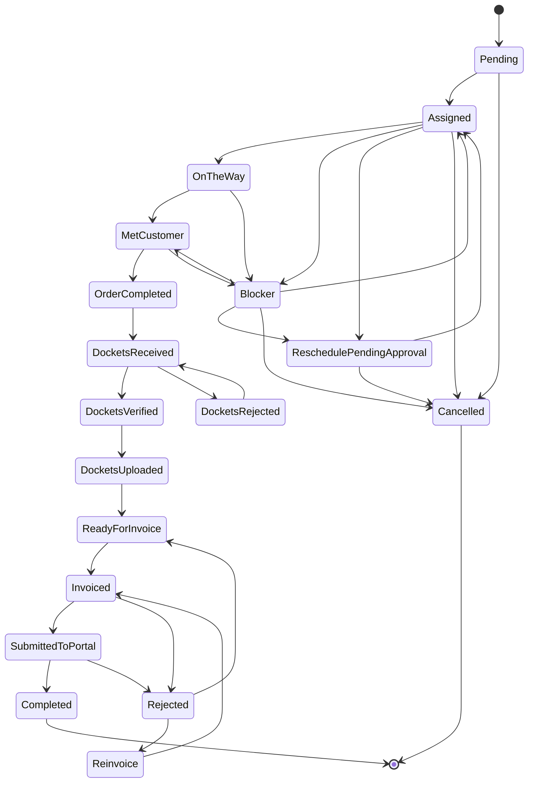

# Order Lifecycle and Statuses (GPON – Canonical)

**Related:** [Process flows](process_flows.md) | [Docket process](docket_process.md) | [Billing & MyInvois](billing_myinvois_flow.md) | [Order lifecycle summary](order_lifecycle_summary.md) | [Status semantics map](status_semantics_map.md)

**Source of truth:** docs/_source/Codebase_Summary_SourceOfTruth.md; docs/_source/Business_Processes_SourceOfTruth.md.

This document is the **single authoritative** lifecycle spec for the GPON department. CWO/NWO will use department-specific workflows when activated (future).

**Workflow authority:** The **DB workflow** (WorkflowDefinition + WorkflowTransitions) is **authoritative** at runtime. The fallback controller graph (OrderStatusesController) is **incomplete/minimal** and must not be relied on for the full GPON flow. See [DB workflow baseline spec](../operations/db_workflow_baseline_spec.md) for the minimum transition set required in DB.

**Status codes:** Status values match [WORKFLOW_STATUS_REFERENCE.md](../05_data_model/WORKFLOW_STATUS_REFERENCE.md) and the seeded workflow ([07_gpon_order_workflow.sql](../backend/scripts/postgresql-seeds/07_gpon_order_workflow.sql)). The code for “invoice rejected” is **Rejected**; the UI may display “Invoice Rejected”. **InProgress** is not an order status (not in reference or seed); field flow is Assigned → OnTheWay → MetCustomer → OrderCompleted.

**Enforcement:** Transitions are enforced by **SiWorkflowGuard** in application code: invalid jumps are rejected, ReschedulePendingApproval requires a non-empty Reason, and completion cannot skip the prior MetCustomer milestone. See [SI_APP_WORKFLOW_HARDENING_REPORT.md](../backend/docs/operations/SI_APP_WORKFLOW_HARDENING_REPORT.md) and [PLATFORM_SAFETY_HARDENING_INDEX.md](../backend/docs/operations/PLATFORM_SAFETY_HARDENING_INDEX.md).

---

## 1. Purpose and scope

- **Scope:** GPON department only. Other departments (CWO, NWO) will define their own lifecycles when activated (Settings → Workflow Definitions).
- **Purpose:** Define how every GPON job moves from creation → scheduling → fieldwork → verification → billing → payment. Reflects real-world processes from TIME, CelcomDigi, U Mobile, SI field operations, admin audit, and internal CephasOps controls.
- **Traceability:** All changes (status, SI action, splitter, docket, invoice, audit, photos) are stored in order status history. Service ID (TBBN or Partner Service ID) is the universal unique key.

---

## 2. Full ordered list of statuses (main flow)

1. **Pending**
2. **Assigned**
3. **OnTheWay**
4. **MetCustomer**
5. **Blocker** (side) or **ReschedulePendingApproval** (side)
6. **OrderCompleted**
7. **DocketsReceived**
8. **DocketsVerified** (Admin QA; docket validated before upload)
9. **DocketsUploaded**
10. **ReadyForInvoice**
11. **Invoiced**
12. **SubmittedToPortal** (after invoice submitted to partner portal, e.g. TIME portal)
13. **Rejected** (side; display: Invoice Rejected when used for billing rejection) or **Reinvoice** (side)
14. **Completed**

**Terminal / side:** **Cancelled** (from Pending, Assigned, Blocker, ReschedulePendingApproval).

*Option A alignment:* DocketsVerified, SubmittedToPortal, and DocketsRejected are real OrderStatus values (engine truth). Docket path: DocketsReceived → DocketsVerified → DocketsUploaded; optional rejection loop: DocketsReceived → DocketsRejected → DocketsReceived.

---

## 3. Master status flow (diagram)



**Text flow (reference):**

```
Pending
  → Assigned
  → OnTheWay
  → MetCustomer
  → (Blocker | ReschedulePendingApproval)
  → OrderCompleted
  → DocketsReceived
  → (DocketsVerified | DocketsRejected → DocketsReceived)*
  → DocketsVerified
  → DocketsUploaded
  → ReadyForInvoice
  → Invoiced
  → SubmittedToPortal (after submission to partner portal, e.g. TIME)
  → (Rejected → ReadyForInvoice → Invoiced)*
  → (Rejected → Reinvoice → Invoiced)*
  → Completed

Side: Cancelled (from Pending, Assigned, Blocker, ReschedulePendingApproval)
```

*Blocker → MetCustomer:* Ops may resume at customer (e.g. issue resolved same day). *Blocker → Assigned:* Ops/HOD may move job back to queue when blocker resolves before SI returns (e.g. building access granted, customer available). AllowedRoles: Ops, Admin, HOD. *Rejected* (invoice rejection; UI may show “Invoice Rejected”) can loop back via ReadyForInvoice (full regeneration) or via Reinvoice (simple correction in TIME Portal).

---

## 4. Allowed transitions and who can trigger them

| From status | To status | Triggered by |
|-------------|-----------|--------------|
| Pending | Assigned | **Ops (Admin)** |
| Pending | Cancelled | **Ops (Admin)** |
| Assigned | OnTheWay | **SI** or **Ops** (manual TIME mirror) |
| Assigned | Blocker | **SI** |
| Assigned | ReschedulePendingApproval | **Ops** |
| Assigned | Cancelled | **Ops** |
| OnTheWay | MetCustomer | **SI** |
| OnTheWay | Blocker | **SI** |
| MetCustomer | OrderCompleted | **SI** |
| MetCustomer | Blocker | **SI** |
| Blocker | Assigned | **Ops** |
| Blocker | MetCustomer | **Ops** (resume at customer; e.g. issue resolved same day) |
| Blocker | ReschedulePendingApproval | **Ops** |
| Blocker | Cancelled | **Ops** |
| ReschedulePendingApproval | Assigned | **Ops** (after TIME email approval) |
| ReschedulePendingApproval | Cancelled | **Ops** |
| OrderCompleted | DocketsReceived | **Ops** |
| DocketsReceived | DocketsVerified | **Ops (Admin)** |
| DocketsVerified | DocketsUploaded | **Ops (Admin)** |
| DocketsUploaded | ReadyForInvoice | **Ops (Billing)** |
| ReadyForInvoice | Invoiced | **Ops (Billing)** |
| Invoiced | SubmittedToPortal | **Ops (Billing)** / **System** (after submission to partner portal, e.g. TIME) |
| Invoiced | Rejected | **System** (TIME rejection; display: Invoice Rejected) |
| SubmittedToPortal | Completed | **Finance** (payment received & matched) |
| SubmittedToPortal | Rejected | **System** (TIME rejection after submission; display: Invoice Rejected) |
| Invoiced | Completed | **Finance** (payment received & matched; if SubmittedToPortal not used) |
| Rejected | ReadyForInvoice | **Ops (Billing)** (full regeneration) |
| Rejected | Reinvoice | **Ops (Billing)** (simple correction path) |
| Reinvoice | Invoiced | **Ops (Billing)** (after correction in TIME Portal) |

**Override-only (invalid without override):** Blocker → OrderCompleted; Blocker → DocketsReceived. Only **HOD / SuperAdmin / Director** can override; require reason, remark, evidence.

---

## 5. Status definitions and rules (summary)

- **Pending:** Order created via parser, manual entry, or API. Admin can edit everything. KPI: Admin.
- **Assigned:** Admin has assigned SI and set appointment. Mandatory before Assigned: Service ID/Partner Order ID, customer details, address, appointment datetime, SI assigned, material list generated, building selected. System creates SI job card, adds to SI calendar, logs assignment. KPI: Admin.
- **OnTheWay:** Set by SI app or Admin (manual TIME mirror). KPI: SI (punctuality).
- **MetCustomer:** SI has met the customer. For **Assurance** orders, RMA fields (material replacements) become editable; SI can record old/new material swaps. KPI: SI (arrival quality).
- **Blocker:** Job cannot proceed. **Pre-Customer Blocker** (from Assigned, OnTheWay): e.g. building denies access, MDF/IDF locked, wrong address, customer postpones. **Post-Customer Blocker** (from MetCustomer): e.g. customer rejects cabling fee, declines installation, technical issue (ONU/router faulty), port mismatch. Mandatory: category, reason, remark, evidence (≥1 photo), gps (SI), reportedBy, timestamp. Valid exits: Assigned, ReschedulePendingApproval, Cancelled. Invalid without override: OrderCompleted, DocketsReceived. KPI: SI or Admin depending on reason.
- **ReschedulePendingApproval:** Admin has requested TIME approval. Locked until TIME email. Exit: Assigned. KPI: Admin.
- **OrderCompleted:** SI has submitted completion package: Splitter ID, Port, ONU Serial, Photos, Signature. For Assurance, SI/Admin records RMA data (serialised: old + new device, TIME approval later; non-serialised: material type + quantity). KPI: SI (accuracy & completeness).
- **DocketsReceived:** Admin has received docket (paper/WhatsApp/email). KPI: Admin (verification).
- **DocketsVerified:** Admin has validated docket (QA passed). Purpose: confirm docket completeness before portal upload. Required evidence: Docket number, Splitter ID + Port, ONU Serial, Completion Photos. Triggered by: **Ops (Admin)**. KPI: Admin (verification quality).
- **DocketsUploaded:** Admin has uploaded docket to TIME Portal. Mandatory: Docket number, Splitter ID + Port, ONU Serial, Completion Photos. KPI: Admin.
- **ReadyForInvoice:** Admin prepares invoice (BOQ/BOW, customer details, rate card, materials). **RMA gate for Assurance:** If serialised materials replaced, all RMA entries must have TIME approval; missing approval **blocks** transition to ReadyForInvoice. Non-serialised: at least one replacement row (material type + quantity). RMA fields read-only after this status. KPI: Admin.
- **Invoiced:** Admin has prepared invoice; ready for submission. Mandatory: BOQ, customer details, rate card, materials. KPI: Admin (billing accuracy).
- **SubmittedToPortal:** Invoice **submitted to partner portal** (e.g. TIME portal). Purpose: order-level confirmation that the invoice has been uploaded to the **partner’s billing portal**, not MyInvois per se. MyInvois (LHDN e-invoice) submission is a separate billing action; when the billing record receives a submissionId from MyInvois, the system may transition the order to SubmittedToPortal. **Relationship:** `invoice.submissionId` (billing/MyInvois) is stored on the Invoice entity; SubmittedToPortal is the **order** status indicating the invoice has been submitted to the partner. Triggered by: **Ops (Billing)** / **System**. System sets 45-day due date. KPI: Admin (billing accuracy).
- **Rejected:** Order/invoice rejected (code `Rejected`; UI may display “Invoice Rejected” in billing context). TIME rejected the invoice. Path 1: Rejected → ReadyForInvoice → Invoiced (full regeneration). Path 2: Rejected → Reinvoice → Invoiced (simple correction in TIME Portal). Rejection reasons include wrong BOQ, wrong rate, wrong job category, missing docket/details/documents, duplicate submission, incorrect splitter/ONU/submissionId. KPI: Admin (billing accuracy failure).
- **Reinvoice:** Admin corrects invoice details inside TIME Portal; then Reinvoice → Invoiced. KPI: Admin.
- **Completed:** Payment received and matched. Order becomes locked. KPI: Finance (optional).
- **Cancelled:** Terminal state. Reasons: customer withdraws, TIME cancels, building denies permanently, duplicate order. KPI: SI or Admin depending on cause.

---

## 6. Checklist gating rules

- **Before Assigned:** Service ID/Partner Order ID, customer details, address, appointment datetime, SI assigned, material list generated, building selected.
- **Docket completeness (before DocketsUploaded):** Docket number, Splitter ID + Port, ONU Serial, Completion Photos. **Splitter details must be complete before docket upload;** no splitter = no docket upload = no invoice.
- **Before ReadyForInvoice (Assurance – RMA):** If serialised materials were replaced, **all RMA entries must have TIME approval** (approvedBy + approvalNotes). Missing approval → **BLOCK** transition to ReadyForInvoice. If non-serialised only, at least one replacement row with material type and quantity.
- **Before Invoiced:** Invoice prepared (BOQ, customer details, rate card, materials).
- **Before SubmittedToPortal:** invoice submitted to partner portal; invoice.submissionId (from MyInvois, when applicable) stored on billing record.

---

## 7. Blocker and reschedule handling

- **Blocker:** Two categories – Pre-Customer (from Assigned, OnTheWay) and Post-Customer (from MetCustomer). Mandatory fields: category, reason, remark, evidence (≥1 photo), gps (SI), reportedBy, timestamp. Valid transitions: Blocker → Assigned; Blocker → MetCustomer; Blocker → ReschedulePendingApproval; Blocker → Cancelled. Blocker → OrderCompleted or Blocker → DocketsReceived **invalid** unless **override** (HOD/SuperAdmin/Director with reason, remark, evidence).
- **Reschedule:** **TIME approval is required for reschedules EXCEPT same-day.** TIME approvals come via email, never API. **Same-day reschedule requires customer evidence:** WhatsApp screenshot, SMS, call log, or voice note. ReschedulePendingApproval is locked until TIME email; exit is ReschedulePendingApproval → Assigned.

---

## 8. Docket verification (Option A – engine truth)

- **DocketsReceived → DocketsVerified:** Admin validates docket (QA). Required: Docket number, Splitter ID + Port, ONU Serial, Completion Photos.
- **DocketsReceived → DocketsRejected:** Admin rejects docket with required reason. SI must correct and resubmit. Rejection reason stored in OrderStatusLog.
- **DocketsRejected → DocketsReceived:** Admin accepts corrected docket from SI. Order returns to receive queue.
- **DocketsVerified → DocketsUploaded:** Admin uploads validated docket to TIME Portal.

---

## 8.1 Upload semantics (DocketsUploaded vs SubmittedToPortal)

| Status | What is uploaded | Where | Who |
|--------|------------------|-------|-----|
| **DocketsUploaded** | Docket (completion evidence: splitter, port, ONU, photos) | **Partner portal** (e.g. TIME portal) | Ops (Admin) |
| **SubmittedToPortal** | Invoice (billing document) | **Partner portal** (e.g. TIME portal) | Ops (Billing) / System |

**Difference:** DocketsUploaded = docket uploaded to partner; SubmittedToPortal = invoice submitted to partner. MyInvois (LHDN e-invoice) submission is a separate billing/regulatory step; the order reaches SubmittedToPortal when the invoice is submitted to the partner portal (which may coincide with or follow MyInvois submission).

---

## 9. Invoice rejection and reinvoice loop

- **Invoiced → Rejected** (display: Invoice Rejected): TIME rejects (e.g. wrong BOQ, wrong rate, wrong job category, missing docket/details/documents, duplicate submission, incorrect splitter/ONU/submissionId).
- **Path 1 (full regeneration):** Rejected → ReadyForInvoice → (admin regenerates) → Invoiced.
- **Path 2 (simple correction):** Rejected → Reinvoice → (admin corrects in TIME Portal) → Invoiced.
- Loop can repeat until invoice is accepted.

**Implementation note:** This loop **depends on DB workflow transitions**. The fallback controller graph (OrderStatusesController) **does not implement** the Rejected/Reinvoice transitions. To support this flow at order status level, the corresponding transitions must be defined in the effective WorkflowDefinition (see [db_workflow_baseline_spec](../operations/db_workflow_baseline_spec.md)). If only billing-level tracking is required, rejection can be tracked on the Billing/Invoice entity without order status transitions.

---

## 10. Override rules

- **Who:** Only **HOD**, **SuperAdmin**, or **Director** can override statuses or validations.
- **Mandatory override fields:** override.enabled, override.role, override.reason, override.remark, override.evidence[], timestamp.
- **Invalid transitions that require override:** Blocker → OrderCompleted; Blocker → DocketsReceived.
- Overrides appear in statusHistory[] and auditTrail[].

---

## 11. Terminal states

- **Completed:** Payment received and matched. Order becomes locked. No further transitions.
- **Cancelled:** Terminal. Reasons: customer withdraws, TIME cancels, building denies permanently, duplicate order. No further transitions.

---

## 12. KPI responsibility matrix (summary)

| Status | Primary actor | KPI impact |
|--------|----------------|------------|
| Pending | Admin | Admin KPI |
| Assigned | Admin | Admin KPI |
| OnTheWay | SI | SI KPI |
| MetCustomer | SI | SI KPI |
| Blocker – Pre | SI/Admin | Mixed |
| Blocker – Post | SI | SI KPI |
| ReschedulePendingApproval | Admin | Admin KPI |
| OrderCompleted | SI | SI KPI |
| DocketsReceived | Admin | Admin KPI |
| DocketsVerified | Admin | Admin KPI |
| DocketsUploaded | Admin | Admin KPI |
| ReadyForInvoice | Admin | Admin KPI |
| Invoiced | Admin | Admin KPI |
| SubmittedToPortal | Admin | Admin KPI |
| Rejected | Admin | Admin KPI |
| Reinvoice | Admin | Admin KPI |
| Completed | Finance | Finance KPI (optional) |
| Cancelled | Admin/SI | Depends on cause |

---

## 13. Audit trail (mandatory)

Every transition logs: performedBy.userId, performedBy.role, timestamp, source, fromStatus, toStatus, beforeValues, afterValues, remark, evidence[], gps (if SI).

---

## 14. Workflow engine validation (implementation)

**Option A applied:** Doc aligned to engine truth. DocketsVerified and SubmittedToPortal are canonical; Blocker → MetCustomer allowed. Remaining mismatches (EmailIngestionService bypass, InvoiceRejected/Reinvoice loop) in:

- **docs/operations/workflow_engine_validation_gpon.md** – Where transitions live, actual transition table, Mermaid diagram from code.
- **docs/_discrepancies.md** – Closed, Open, Accepted, and Deferred items; code locations.

---

## 15. Core principles (reference)

- Every order is fully traceable; changes stored in status history.
- Service ID (TBBN or partner format) is the universal key.
- TIME approval required for reschedules except same-day; same-day needs customer evidence.
- Splitter details must be complete before docket upload; no splitter = no docket = no invoice.
- Billing relies on data accuracy; wrong ONU/splitter/photos → risk of non-payment.
- TIME X Portal is reference only; no API; Admin mirrors statuses manually with evidence.
- SI App is source of truth for fieldwork (GPS, ONU scan, port, photos, signature).
- Only HOD/SuperAdmin/Director can override protections; overrides require reason, remark, evidence.
