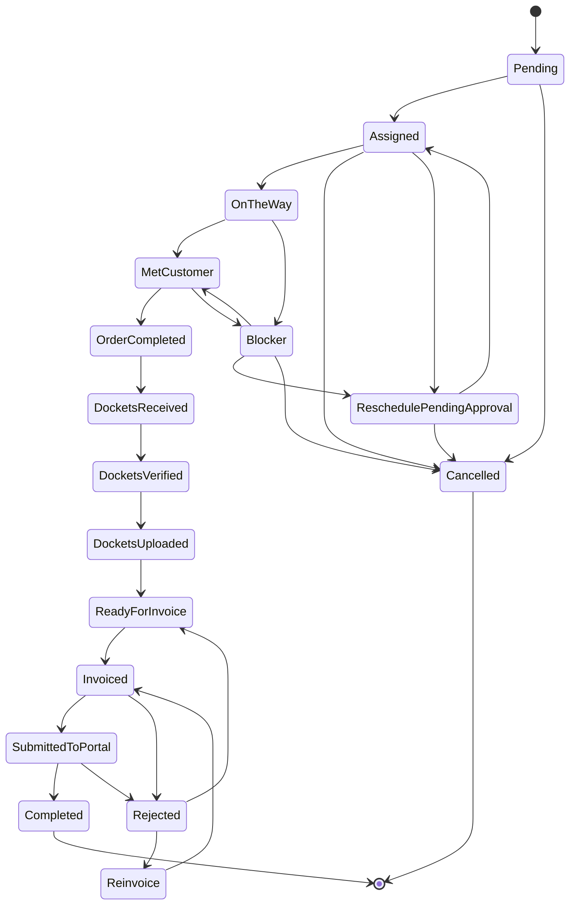

# Workflow Engine Validation – GPON Order Workflow

**Related:** [Order lifecycle and statuses (canonical)](../business/order_lifecycle_and_statuses.md) | [Order lifecycle summary](../business/order_lifecycle_summary.md) | [Background jobs](background_jobs.md)

**Source of truth (expected flow):** docs/business/order_lifecycle_and_statuses.md; docs/_source/Business_Processes_SourceOfTruth.md; docs/_source/Codebase_Summary_SourceOfTruth.md.

**Last validation run:** 2026-02-03

This document records where GPON order workflow transitions are implemented and the **actual** transition graph extracted from code. It is used to validate the canonical lifecycle doc against the engine.

---

## 1. Where transitions live

| Location | Purpose |
|----------|---------|
| **Domain** | `backend/src/CephasOps.Domain/Orders/Enums/OrderStatus.cs` – Single source of valid status **strings** (17 total). All status values used in transitions must match these constants. |
| **Workflow engine** | `backend/src/CephasOps.Application/Workflow/Services/WorkflowEngineService.cs` – Executes transitions by loading **WorkflowDefinition** and **WorkflowTransition** from DB for `EntityType = "Order"`. Validates guards via `GuardConditionValidatorRegistry`, runs side effects via `SideEffectExecutorRegistry`, then updates entity status. |
| **Workflow definitions** | `backend/src/CephasOps.Application/Workflow/Services/WorkflowDefinitionsService.cs` – CRUD for WorkflowDefinition and WorkflowTransition. **GetEffectiveWorkflowDefinitionAsync(companyId, "Order", null)** returns the active Order workflow (partner-specific or general). |
| **DB persistence** | `WorkflowDefinitions`, `WorkflowTransitions` tables. Runtime authority is **whatever is in the DB**. |
| **DB seed (minimal)** | `backend/scripts/create-order-workflow-if-missing.sql` – Creates one WorkflowDefinition (EntityType=Order) and **one transition only**: Pending → Assigned (with checkMaterialCollection side effect). `add-invoice-rejection-loop-transitions.sql` – Adds optional invoice rejection loop (Invoiced/SubmittedToPortal→Rejected, Rejected→ReadyForInvoice/Reinvoice, Reinvoice→Invoiced). Run after create-order-workflow-if-missing.sql. |
| **Fallback (code-only graph)** | `backend/src/CephasOps.Api/Controllers/OrderStatusesController.cs` (lines 234–251) – When `entityId`/`entityType` are not provided, **GET /api/order-statuses/{code}/transitions** returns a **hardcoded** next-status list. This is the only full transition graph defined in code and is used for backward compatibility and when workflow engine is not queried. |
| **Billing-driven transition** | `backend/src/CephasOps.Application/Billing/Services/InvoiceSubmissionService.cs` – After invoice submission, transitions **related orders** to **SubmittedToPortal** via `WorkflowEngineService.ExecuteTransitionAsync` (transition Invoiced → SubmittedToPortal must exist in effective workflow). |
| **Bypasses (allowed – Pending only)** | `backend/src/CephasOps.Application/Parser/Services/EmailIngestionService.cs` – May set **only `order.Status = "Pending"`** directly (order intake). All other statuses (Assigned, Cancelled, Blocker, etc.) must go through WorkflowEngineService. *Code currently also sets Cancelled and Blocker directly—those are violations.* When setting Pending: create OrderStatusLog, source=EmailIngestionService, timestamp + parser/session reference. |

**GPON Order workflow definition name/key:** Not fixed in code. The effective definition is the first active `WorkflowDefinition` with `EntityType = "Order"` and `PartnerId = null` (or matching partner). Name is arbitrary (e.g. "GPON_Order_Workflow" if created via UI).

---

## 2. Actual transition graph (from code)

The following table is derived from:

- **OrderStatus** enum (status list).
- **OrderStatusesController** fallback mapping (lines 226–259) – the only complete transition graph in code.
- **InvoiceSubmissionService** – Invoiced → SubmittedToPortal triggered by billing submission.

Guards, roles, and side effects are **not** in code for the fallback; they are defined per transition in the DB (GuardConditionsJson, AllowedRolesJson, SideEffectsConfigJson). The engine applies them when executing a transition.

**Overrides:** Canonical doc §10 describes HOD/SuperAdmin/Director overrides for Blocker → OrderCompleted and Blocker → DocketsReceived. WorkflowEngineService has no built-in override logic; such transitions would need to be defined in DB with appropriate AllowedRolesJson.

**Side effects (from settings):** `SideEffectExecutorRegistry` runs executors defined in `SideEffectDefinitions` table (e.g. `createOrderStatusLog`, `updateOrderFlags`, `checkMaterialCollection`, `triggerInvoiceEligibility`). Seed: `backend/src/CephasOps.Infrastructure/Persistence/Migrations/20250106_SeedAllReferenceData.sql`, `backend/scripts/postgresql-seeds/04_configuration_data.sql`.

| # | FromStatus | ToStatus | Trigger (from code / fallback) | Guards (code) | Side effects (code) | Override |
|---|------------|----------|--------------------------------|---------------|---------------------|----------|
| 1 | *(initial)* | Pending | (order creation) | — | — | — |
| 2 | Pending | Assigned | Ops (Admin) | — | — | — |
| 3 | Pending | Cancelled | Ops (Admin) | — | — | — |
| 4 | Assigned | OnTheWay | SI / Ops | — | — | — |
| 5 | Assigned | Cancelled | Ops | — | — | — |
| 6 | Assigned | ReschedulePendingApproval | Ops | — | — | — |
| 7 | OnTheWay | MetCustomer | SI | — | — | — |
| 8 | OnTheWay | Blocker | SI | — | — | — |
| 9 | MetCustomer | OrderCompleted | SI | — | — | — |
| 10 | MetCustomer | Blocker | SI | — | — | — |
| 11 | Blocker | MetCustomer | Ops | — | — | — |
| 12 | Blocker | ReschedulePendingApproval | Ops | — | — | — |
| 13 | Blocker | Cancelled | Ops | — | — | — |
| 14 | ReschedulePendingApproval | Assigned | Ops | — | — | — |
| 15 | ReschedulePendingApproval | Cancelled | Ops | — | — | — |
| 16 | OrderCompleted | DocketsReceived | Ops | — | — | — |
| 17 | DocketsReceived | DocketsVerified | Admin | — | — | — |
| 18 | DocketsVerified | DocketsUploaded | Admin | — | — | — |
| 19 | DocketsUploaded | ReadyForInvoice | Ops (Billing) | — | — | — |
| 20 | ReadyForInvoice | Invoiced | Admin | — | — | — |
| 21 | Invoiced | SubmittedToPortal | Admin / System (InvoiceSubmissionService) | — | — | — |
| 22 | Invoiced | Rejected | Admin / System | — | — | — |
| 23 | SubmittedToPortal | Completed | Finance / System | — | — | — |
| 24 | SubmittedToPortal | Rejected | Admin / System | — | — | — |
| 25 | Rejected | ReadyForInvoice | Admin (Billing) | — | — | — |
| 26 | Rejected | Reinvoice | Admin (Billing) | — | — | — |
| 27 | Reinvoice | Invoiced | Admin (Billing) | — | — | — |
| 28 | Completed | — | (terminal) | — | — | — |
| 29 | Cancelled | — | (terminal) | — | — | — |

**Notes:**

- **Assigned → Blocker** is **not** in the fallback; only **OnTheWay → Blocker** and **MetCustomer → Blocker** exist.
- **Blocker → Assigned** is **not** in the fallback; code has **Blocker → MetCustomer** (and ReschedulePendingApproval, Cancelled). Canonical doc (Option A) now allows both Blocker → Assigned and Blocker → MetCustomer.
- **DocketsVerified** and **SubmittedToPortal** are in code and now in canonical doc (Option A alignment).
- **Invoice rejection loop (2026-02-03):** Rejected (display name "Invoice Rejected") and Reinvoice are in fallback. Transitions: Invoiced→Rejected, SubmittedToPortal→Rejected, Rejected→ReadyForInvoice, Rejected→Reinvoice, Reinvoice→Invoiced. DB script: add-invoice-rejection-loop-transitions.sql.

---

## 3. Status list: code vs doc

| Code (OrderStatus.cs + OrderStatusesController) | Doc (order_lifecycle_and_statuses.md) – Option A |
|---------------------------------------------------|--------------------------------------------------|
| Pending, Assigned, OnTheWay, MetCustomer, OrderCompleted | Same |
| DocketsReceived, **DocketsVerified**, DocketsUploaded | Same (**Option A alignment**) |
| ReadyForInvoice, Invoiced, **SubmittedToPortal**, Completed | Same (**Option A alignment**) |
| Blocker, ReschedulePendingApproval, **Rejected**, Cancelled, Reinvoice | Blocker, ReschedulePendingApproval, **InvoiceRejected**, Cancelled, Reinvoice (naming: doc uses InvoiceRejected) |

---

## 4. Mermaid state diagram (from code fallback)

---

## 5. Validation summary

- **Total statuses (code):** 17 (OrderStatus.AllStatuses).
- **Total statuses (doc):** 17 (main + side; Option A aligned for DocketsVerified, SubmittedToPortal).
- **Total transitions (code fallback):** 22 (excluding terminal).
- **Total transitions (doc):** Doc uses DocketsVerified path; InvoiceRejected/Reinvoice loop; Blocker → Assigned + Blocker → MetCustomer.
- **Option A alignment:** Docket and invoice main paths aligned. See [docs/_discrepancies.md](../_discrepancies.md) for current audit status (Closed, Open, Accepted, Deferred).

---

## 6. Comparison with canonical (Option A applied)

**Canonical Mermaid diagram:** [order_lifecycle_and_statuses.md §3](../business/order_lifecycle_and_statuses.md#3-master-status-flow-diagram)

| Aspect | Canonical (doc) – Option A | Code (fallback / OrderStatus) | Aligned? |
|--------|---------------------------|-------------------------------|----------|
| Docket path | DocketsReceived → DocketsVerified → DocketsUploaded | Same | Yes |
| Invoice path | Invoiced → SubmittedToPortal → Completed | Same | Yes |
| Blocker exits | Blocker → Assigned, MetCustomer, ReschedulePendingApproval, Cancelled | Blocker → MetCustomer, ReschedulePendingApproval, Cancelled (no Assigned) | Partial (doc allows both; code has MetCustomer only) |
| Assigned → Blocker | Allowed | Not in fallback | No |
| DocketsVerified, SubmittedToPortal | Canonical statuses | Same | Yes |

Audit register: [_discrepancies.md](../_discrepancies.md). Workflow items (A–J) closed.
